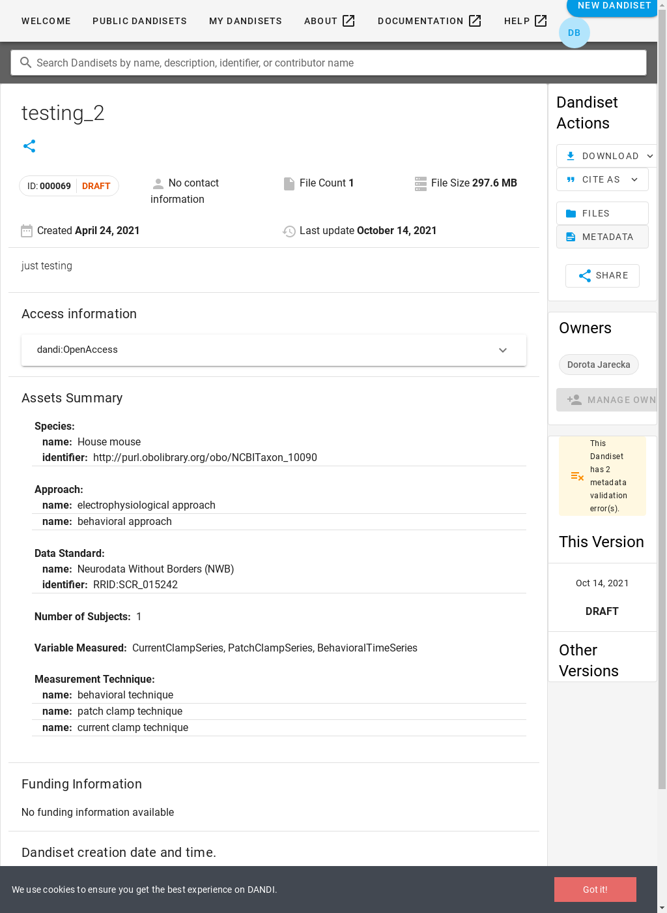
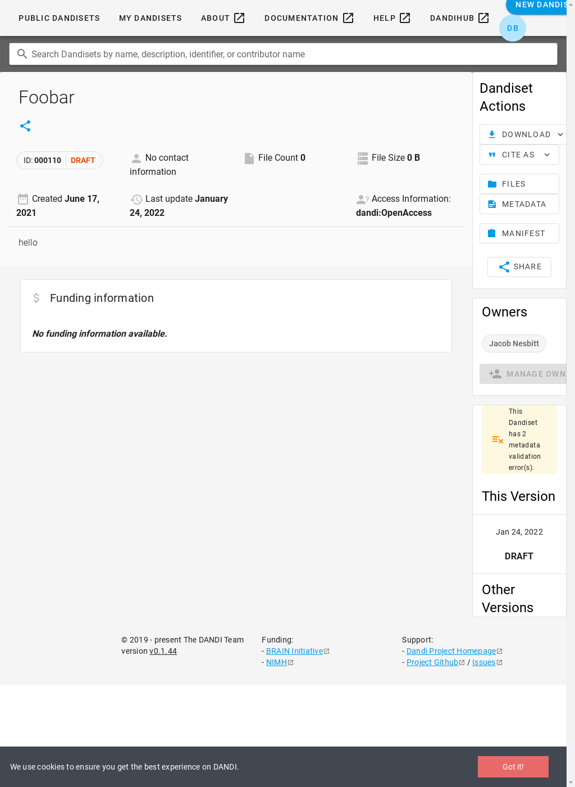
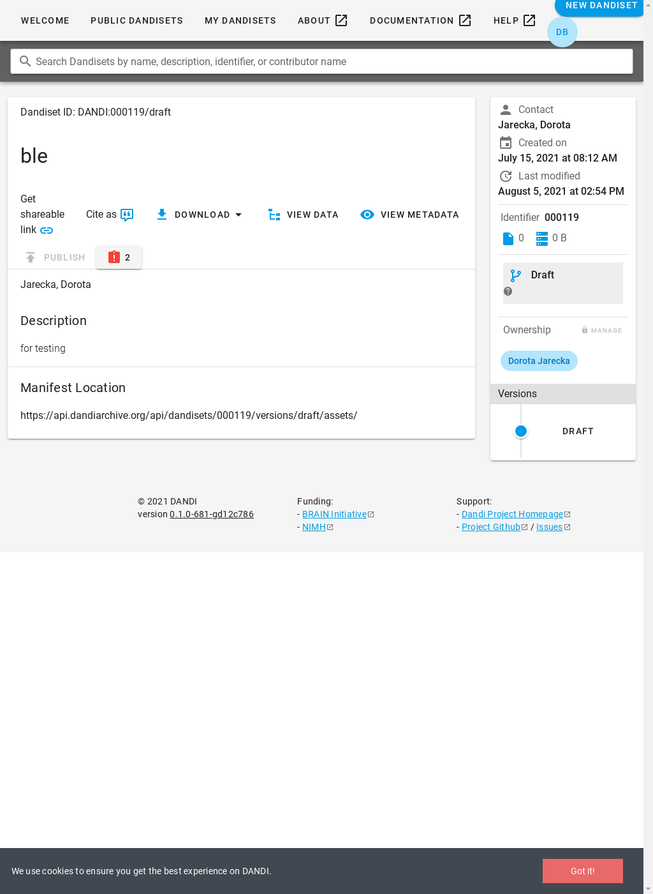

| Page | Min Time | Mean ± StdDev | Max Time | Errors |
| --- | --- | --- | --- | --- |
| landing | 0.02s ([000051](#000051)) | 0.04s ± 0.05s | 0.23s ([000134](#000134)) | — |
| edit-metadata | 1.23s ([000123](#000123)) | 1.77s ± 0.84s | 8.73s ([000026](#000026)) | — |
| view-data | 0.02s ([000020](#000020)) | 0.07s ± 0.12s | 0.87s ([000117](#000117)) | — |

### 000003

| t=0.17 [Go to page](https://gui.dandiarchive.org/#/dandiset/000003) | t=1.75 Edit Metadata | t=0.03 [Go to page](https://gui.dandiarchive.org/#/dandiset/000003/draft/files) |
| --- | --- | --- |
|  |  |  |

### 000004

| t=0.13 [Go to page](https://gui.dandiarchive.org/#/dandiset/000004) | t=3.77 Edit Metadata | t=0.03 [Go to page](https://gui.dandiarchive.org/#/dandiset/000004/draft/files) |
| --- | --- | --- |
|  |  |  |

### 000005

| t=0.02 [Go to page](https://gui.dandiarchive.org/#/dandiset/000005) | t=1.94 Edit Metadata | t=0.03 [Go to page](https://gui.dandiarchive.org/#/dandiset/000005/draft/files) |
| --- | --- | --- |
|  |  |  |

### 000006

| t=0.02 [Go to page](https://gui.dandiarchive.org/#/dandiset/000006) | t=1.58 Edit Metadata | t=0.03 [Go to page](https://gui.dandiarchive.org/#/dandiset/000006/draft/files) |
| --- | --- | --- |
|  |  |  |

### 000007

| t=0.02 [Go to page](https://gui.dandiarchive.org/#/dandiset/000007) | t=2.19 Edit Metadata | t=0.03 [Go to page](https://gui.dandiarchive.org/#/dandiset/000007/draft/files) |
| --- | --- | --- |
|  |  |  |

### 000008

| t=0.02 [Go to page](https://gui.dandiarchive.org/#/dandiset/000008) | t=3.51 Edit Metadata | t=0.03 [Go to page](https://gui.dandiarchive.org/#/dandiset/000008/draft/files) |
| --- | --- | --- |
|  |  |  |

### 000009

| t=0.02 [Go to page](https://gui.dandiarchive.org/#/dandiset/000009) | t=1.99 Edit Metadata | t=0.12 [Go to page](https://gui.dandiarchive.org/#/dandiset/000009/draft/files) |
| --- | --- | --- |
|  |  |  |

### 000010

| t=0.03 [Go to page](https://gui.dandiarchive.org/#/dandiset/000010) | t=1.93 Edit Metadata | t=0.03 [Go to page](https://gui.dandiarchive.org/#/dandiset/000010/draft/files) |
| --- | --- | --- |
|  |  |  |

### 000011

| t=0.02 [Go to page](https://gui.dandiarchive.org/#/dandiset/000011) | t=1.98 Edit Metadata | t=0.03 [Go to page](https://gui.dandiarchive.org/#/dandiset/000011/draft/files) |
| --- | --- | --- |
|  |  |  |

### 000012

| t=0.02 [Go to page](https://gui.dandiarchive.org/#/dandiset/000012) | t=1.70 Edit Metadata | t=0.03 [Go to page](https://gui.dandiarchive.org/#/dandiset/000012/draft/files) |
| --- | --- | --- |
|  |  |  |

### 000013

| t=0.02 [Go to page](https://gui.dandiarchive.org/#/dandiset/000013) | t=1.90 Edit Metadata | t=0.03 [Go to page](https://gui.dandiarchive.org/#/dandiset/000013/draft/files) |
| --- | --- | --- |
|  |  |  |

### 000015

| t=0.02 [Go to page](https://gui.dandiarchive.org/#/dandiset/000015) | t=2.11 Edit Metadata | t=0.02 [Go to page](https://gui.dandiarchive.org/#/dandiset/000015/draft/files) |
| --- | --- | --- |
|  |  |  |

### 000016

| t=0.12 [Go to page](https://gui.dandiarchive.org/#/dandiset/000016) | t=1.71 Edit Metadata | t=0.14 [Go to page](https://gui.dandiarchive.org/#/dandiset/000016/draft/files) |
| --- | --- | --- |
|  |  |  |

### 000017

| t=0.02 [Go to page](https://gui.dandiarchive.org/#/dandiset/000017) | t=1.92 Edit Metadata | t=0.03 [Go to page](https://gui.dandiarchive.org/#/dandiset/000017/draft/files) |
| --- | --- | --- |
|  |  |  |

### 000018

| t=0.02 [Go to page](https://gui.dandiarchive.org/#/dandiset/000018) | t=1.59 Edit Metadata | t=0.12 [Go to page](https://gui.dandiarchive.org/#/dandiset/000018/draft/files) |
| --- | --- | --- |
|  |  |  |

### 000019

| t=0.02 [Go to page](https://gui.dandiarchive.org/#/dandiset/000019) | t=1.63 Edit Metadata | t=0.03 [Go to page](https://gui.dandiarchive.org/#/dandiset/000019/draft/files) |
| --- | --- | --- |
|  |  |  |

### 000020

| t=0.02 [Go to page](https://gui.dandiarchive.org/#/dandiset/000020) | t=1.66 Edit Metadata | t=0.02 [Go to page](https://gui.dandiarchive.org/#/dandiset/000020/draft/files) |
| --- | --- | --- |
|  |  |  |

### 000021

| t=0.02 [Go to page](https://gui.dandiarchive.org/#/dandiset/000021) | t=2.62 Edit Metadata | t=0.03 [Go to page](https://gui.dandiarchive.org/#/dandiset/000021/draft/files) |
| --- | --- | --- |
|  |  |  |

### 000022

| t=0.02 [Go to page](https://gui.dandiarchive.org/#/dandiset/000022) | t=2.50 Edit Metadata | t=0.13 [Go to page](https://gui.dandiarchive.org/#/dandiset/000022/draft/files) |
| --- | --- | --- |
|  |  |  |

### 000023

| t=0.02 [Go to page](https://gui.dandiarchive.org/#/dandiset/000023) | t=1.66 Edit Metadata | t=0.03 [Go to page](https://gui.dandiarchive.org/#/dandiset/000023/draft/files) |
| --- | --- | --- |
|  |  |  |

### 000024

| t=0.02 [Go to page](https://gui.dandiarchive.org/#/dandiset/000024) | t=1.38 Edit Metadata | t=0.03 [Go to page](https://gui.dandiarchive.org/#/dandiset/000024/draft/files) |
| --- | --- | --- |
|  |  |  |

### 000025

| t=0.02 [Go to page](https://gui.dandiarchive.org/#/dandiset/000025) | t=1.29 Edit Metadata | t=0.12 [Go to page](https://gui.dandiarchive.org/#/dandiset/000025/draft/files) |
| --- | --- | --- |
|  |  |  |

### 000026

| t=0.02 [Go to page](https://gui.dandiarchive.org/#/dandiset/000026) | t=8.73 Edit Metadata | t=0.13 [Go to page](https://gui.dandiarchive.org/#/dandiset/000026/draft/files) |
| --- | --- | --- |
|  |  |  |

### 000027

| t=0.02 [Go to page](https://gui.dandiarchive.org/#/dandiset/000027) | t=1.41 Edit Metadata | t=0.48 [Go to page](https://gui.dandiarchive.org/#/dandiset/000027/draft/files) |
| --- | --- | --- |
|  |  |  |

### 000028

| t=0.02 [Go to page](https://gui.dandiarchive.org/#/dandiset/000028) | t=1.29 Edit Metadata | t=0.03 [Go to page](https://gui.dandiarchive.org/#/dandiset/000028/draft/files) |
| --- | --- | --- |
|  |  |  |

### 000029

| t=0.02 [Go to page](https://gui.dandiarchive.org/#/dandiset/000029) | t=1.56 Edit Metadata | t=0.03 [Go to page](https://gui.dandiarchive.org/#/dandiset/000029/draft/files) |
| --- | --- | --- |
|  |  |  |

### 000030

| t=0.02 [Go to page](https://gui.dandiarchive.org/#/dandiset/000030) | t=1.28 Edit Metadata | t=0.03 [Go to page](https://gui.dandiarchive.org/#/dandiset/000030/draft/files) |
| --- | --- | --- |
|  |  |  |

### 000031

| t=0.02 [Go to page](https://gui.dandiarchive.org/#/dandiset/000031) | t=1.32 Edit Metadata | t=0.02 [Go to page](https://gui.dandiarchive.org/#/dandiset/000031/draft/files) |
| --- | --- | --- |
|  |  |  |

### 000032

| t=0.02 [Go to page](https://gui.dandiarchive.org/#/dandiset/000032) | t=1.32 Edit Metadata | t=0.03 [Go to page](https://gui.dandiarchive.org/#/dandiset/000032/draft/files) |
| --- | --- | --- |
|  |  |  |

### 000033

| t=0.02 [Go to page](https://gui.dandiarchive.org/#/dandiset/000033) | t=1.31 Edit Metadata | t=0.03 [Go to page](https://gui.dandiarchive.org/#/dandiset/000033/draft/files) |
| --- | --- | --- |
|  |  |  |

### 000034

| t=0.02 [Go to page](https://gui.dandiarchive.org/#/dandiset/000034) | t=2.27 Edit Metadata | t=0.02 [Go to page](https://gui.dandiarchive.org/#/dandiset/000034/draft/files) |
| --- | --- | --- |
|  |  |  |

### 000035

| t=0.02 [Go to page](https://gui.dandiarchive.org/#/dandiset/000035) | t=3.53 Edit Metadata | t=0.03 [Go to page](https://gui.dandiarchive.org/#/dandiset/000035/draft/files) |
| --- | --- | --- |
|  |  |  |

### 000036

| t=0.02 [Go to page](https://gui.dandiarchive.org/#/dandiset/000036) | t=1.53 Edit Metadata | t=0.02 [Go to page](https://gui.dandiarchive.org/#/dandiset/000036/draft/files) |
| --- | --- | --- |
|  |  |  |

### 000037

| t=0.02 [Go to page](https://gui.dandiarchive.org/#/dandiset/000037) | t=2.20 Edit Metadata | t=0.02 [Go to page](https://gui.dandiarchive.org/#/dandiset/000037/draft/files) |
| --- | --- | --- |
|  |  |  |

### 000038

| t=0.02 [Go to page](https://gui.dandiarchive.org/#/dandiset/000038) | t=1.31 Edit Metadata | t=0.03 [Go to page](https://gui.dandiarchive.org/#/dandiset/000038/draft/files) |
| --- | --- | --- |
|  |  |  |

### 000039

| t=0.03 [Go to page](https://gui.dandiarchive.org/#/dandiset/000039) | t=1.70 Edit Metadata | t=0.03 [Go to page](https://gui.dandiarchive.org/#/dandiset/000039/draft/files) |
| --- | --- | --- |
|  |  |  |

### 000040

| t=0.02 [Go to page](https://gui.dandiarchive.org/#/dandiset/000040) | t=1.90 Edit Metadata | t=0.02 [Go to page](https://gui.dandiarchive.org/#/dandiset/000040/draft/files) |
| --- | --- | --- |
|  |  |  |

### 000041

| t=0.02 [Go to page](https://gui.dandiarchive.org/#/dandiset/000041) | t=2.13 Edit Metadata | t=0.02 [Go to page](https://gui.dandiarchive.org/#/dandiset/000041/draft/files) |
| --- | --- | --- |
|  |  |  |

### 000042

| t=0.13 [Go to page](https://gui.dandiarchive.org/#/dandiset/000042) | t=1.46 Edit Metadata | t=0.03 [Go to page](https://gui.dandiarchive.org/#/dandiset/000042/draft/files) |
| --- | --- | --- |
|  |  |  |

### 000043

| t=0.02 [Go to page](https://gui.dandiarchive.org/#/dandiset/000043) | t=1.85 Edit Metadata | t=0.39 [Go to page](https://gui.dandiarchive.org/#/dandiset/000043/draft/files) |
| --- | --- | --- |
|  |  |  |

### 000044

| t=0.02 [Go to page](https://gui.dandiarchive.org/#/dandiset/000044) | t=1.68 Edit Metadata | t=0.12 [Go to page](https://gui.dandiarchive.org/#/dandiset/000044/draft/files) |
| --- | --- | --- |
|  |  |  |

### 000045

| t=0.02 [Go to page](https://gui.dandiarchive.org/#/dandiset/000045) | t=1.68 Edit Metadata | t=0.03 [Go to page](https://gui.dandiarchive.org/#/dandiset/000045/draft/files) |
| --- | --- | --- |
|  |  |  |

### 000046

| t=0.12 [Go to page](https://gui.dandiarchive.org/#/dandiset/000046) | t=1.34 Edit Metadata | t=0.03 [Go to page](https://gui.dandiarchive.org/#/dandiset/000046/draft/files) |
| --- | --- | --- |
|  |  |  |

### 000047

| t=0.02 [Go to page](https://gui.dandiarchive.org/#/dandiset/000047) | t=1.26 Edit Metadata | t=0.10 [Go to page](https://gui.dandiarchive.org/#/dandiset/000047/draft/files) |
| --- | --- | --- |
|  |  |  |

### 000048

| t=0.02 [Go to page](https://gui.dandiarchive.org/#/dandiset/000048) | t=2.74 Edit Metadata | t=0.03 [Go to page](https://gui.dandiarchive.org/#/dandiset/000048/draft/files) |
| --- | --- | --- |
|  |  |  |

### 000049

| t=0.02 [Go to page](https://gui.dandiarchive.org/#/dandiset/000049) | t=1.51 Edit Metadata | t=0.03 [Go to page](https://gui.dandiarchive.org/#/dandiset/000049/draft/files) |
| --- | --- | --- |
|  |  |  |

### 000050

| t=0.02 [Go to page](https://gui.dandiarchive.org/#/dandiset/000050) | t=1.34 Edit Metadata | t=0.12 [Go to page](https://gui.dandiarchive.org/#/dandiset/000050/draft/files) |
| --- | --- | --- |
|  |  |  |

### 000051

| t=0.02 [Go to page](https://gui.dandiarchive.org/#/dandiset/000051) | t=1.76 Edit Metadata | t=0.02 [Go to page](https://gui.dandiarchive.org/#/dandiset/000051/draft/files) |
| --- | --- | --- |
|  |  |  |

### 000052

| t=0.02 [Go to page](https://gui.dandiarchive.org/#/dandiset/000052) | t=1.44 Edit Metadata | t=0.03 [Go to page](https://gui.dandiarchive.org/#/dandiset/000052/draft/files) |
| --- | --- | --- |
|  |  |  |

### 000053

| t=0.02 [Go to page](https://gui.dandiarchive.org/#/dandiset/000053) | t=2.37 Edit Metadata | t=0.12 [Go to page](https://gui.dandiarchive.org/#/dandiset/000053/draft/files) |
| --- | --- | --- |
|  |  |  |

### 000054

| t=0.02 [Go to page](https://gui.dandiarchive.org/#/dandiset/000054) | t=1.68 Edit Metadata | t=0.14 [Go to page](https://gui.dandiarchive.org/#/dandiset/000054/draft/files) |
| --- | --- | --- |
|  |  |  |

### 000055

| t=0.15 [Go to page](https://gui.dandiarchive.org/#/dandiset/000055) | t=2.36 Edit Metadata | t=0.03 [Go to page](https://gui.dandiarchive.org/#/dandiset/000055/draft/files) |
| --- | --- | --- |
|  |  |  |

### 000056

| t=0.02 [Go to page](https://gui.dandiarchive.org/#/dandiset/000056) | t=2.14 Edit Metadata | t=0.02 [Go to page](https://gui.dandiarchive.org/#/dandiset/000056/draft/files) |
| --- | --- | --- |
|  |  |  |

### 000057

| t=0.02 [Go to page](https://gui.dandiarchive.org/#/dandiset/000057) | t=1.35 Edit Metadata | t=0.14 [Go to page](https://gui.dandiarchive.org/#/dandiset/000057/draft/files) |
| --- | --- | --- |
|  |  |  |

### 000058

| t=0.02 [Go to page](https://gui.dandiarchive.org/#/dandiset/000058) | t=1.44 Edit Metadata | t=0.02 [Go to page](https://gui.dandiarchive.org/#/dandiset/000058/draft/files) |
| --- | --- | --- |
|  |  |  |

### 000059

| t=0.02 [Go to page](https://gui.dandiarchive.org/#/dandiset/000059) | t=1.61 Edit Metadata | t=0.03 [Go to page](https://gui.dandiarchive.org/#/dandiset/000059/draft/files) |
| --- | --- | --- |
|  |  |  |

### 000060

| t=0.02 [Go to page](https://gui.dandiarchive.org/#/dandiset/000060) | t=1.70 Edit Metadata | t=0.02 [Go to page](https://gui.dandiarchive.org/#/dandiset/000060/draft/files) |
| --- | --- | --- |
|  |  |  |

### 000061

| t=0.02 [Go to page](https://gui.dandiarchive.org/#/dandiset/000061) | t=1.64 Edit Metadata | t=0.03 [Go to page](https://gui.dandiarchive.org/#/dandiset/000061/draft/files) |
| --- | --- | --- |
|  |  |  |

### 000063

| t=0.02 [Go to page](https://gui.dandiarchive.org/#/dandiset/000063) | t=1.27 Edit Metadata | t=0.03 [Go to page](https://gui.dandiarchive.org/#/dandiset/000063/draft/files) |
| --- | --- | --- |
|  |  |  |

### 000064

| t=0.02 [Go to page](https://gui.dandiarchive.org/#/dandiset/000064) | t=1.35 Edit Metadata | t=0.03 [Go to page](https://gui.dandiarchive.org/#/dandiset/000064/draft/files) |
| --- | --- | --- |
|  |  |  |

### 000065

| t=0.02 [Go to page](https://gui.dandiarchive.org/#/dandiset/000065) | t=1.36 Edit Metadata | t=0.03 [Go to page](https://gui.dandiarchive.org/#/dandiset/000065/draft/files) |
| --- | --- | --- |
|  |  |  |

### 000066

| t=0.02 [Go to page](https://gui.dandiarchive.org/#/dandiset/000066) | t=1.49 Edit Metadata | t=0.12 [Go to page](https://gui.dandiarchive.org/#/dandiset/000066/draft/files) |
| --- | --- | --- |
|  |  |  |

### 000067

| t=0.02 [Go to page](https://gui.dandiarchive.org/#/dandiset/000067) | t=1.71 Edit Metadata | t=0.03 [Go to page](https://gui.dandiarchive.org/#/dandiset/000067/draft/files) |
| --- | --- | --- |
|  |  |  |

### 000068

| t=0.14 [Go to page](https://gui.dandiarchive.org/#/dandiset/000068) | t=1.27 Edit Metadata | t=0.10 [Go to page](https://gui.dandiarchive.org/#/dandiset/000068/draft/files) |
| --- | --- | --- |
|  |  |  |

### 000069

| t=0.02 [Go to page](https://gui.dandiarchive.org/#/dandiset/000069) | t=1.36 Edit Metadata | t=0.03 [Go to page](https://gui.dandiarchive.org/#/dandiset/000069/draft/files) |
| --- | --- | --- |
|  |  |  |

### 000070

| t=0.02 [Go to page](https://gui.dandiarchive.org/#/dandiset/000070) | t=2.89 Edit Metadata | t=0.03 [Go to page](https://gui.dandiarchive.org/#/dandiset/000070/draft/files) |
| --- | --- | --- |
|  |  |  |

### 000071

| t=0.12 [Go to page](https://gui.dandiarchive.org/#/dandiset/000071) | t=1.32 Edit Metadata | t=0.03 [Go to page](https://gui.dandiarchive.org/#/dandiset/000071/draft/files) |
| --- | --- | --- |
|  |  |  |

### 000072

| t=0.03 [Go to page](https://gui.dandiarchive.org/#/dandiset/000072) | t=1.29 Edit Metadata | t=0.03 [Go to page](https://gui.dandiarchive.org/#/dandiset/000072/draft/files) |
| --- | --- | --- |
|  |  |  |

### 000105

| t=0.02 [Go to page](https://gui.dandiarchive.org/#/dandiset/000105) | t=1.48 Edit Metadata | t=0.03 [Go to page](https://gui.dandiarchive.org/#/dandiset/000105/draft/files) |
| --- | --- | --- |
|  |  |  |

### 000106

| t=0.23 [Go to page](https://gui.dandiarchive.org/#/dandiset/000106) | t=1.51 Edit Metadata | t=0.43 [Go to page](https://gui.dandiarchive.org/#/dandiset/000106/draft/files) |
| --- | --- | --- |
|  |  |  |

### 000107

| t=0.02 [Go to page](https://gui.dandiarchive.org/#/dandiset/000107) | t=1.42 Edit Metadata | t=0.03 [Go to page](https://gui.dandiarchive.org/#/dandiset/000107/draft/files) |
| --- | --- | --- |
|  |  |  |

### 000108

| t=0.02 [Go to page](https://gui.dandiarchive.org/#/dandiset/000108) | t=1.49 Edit Metadata | t=0.02 [Go to page](https://gui.dandiarchive.org/#/dandiset/000108/draft/files) |
| --- | --- | --- |
|  |  |  |

### 000109

| t=0.02 [Go to page](https://gui.dandiarchive.org/#/dandiset/000109) | t=1.71 Edit Metadata | t=0.02 [Go to page](https://gui.dandiarchive.org/#/dandiset/000109/draft/files) |
| --- | --- | --- |
|  |  |  |

### 000110

| t=0.02 [Go to page](https://gui.dandiarchive.org/#/dandiset/000110) | t=1.42 Edit Metadata | t=0.03 [Go to page](https://gui.dandiarchive.org/#/dandiset/000110/draft/files) |
| --- | --- | --- |
|  |  |  |

### 000111

| t=0.02 [Go to page](https://gui.dandiarchive.org/#/dandiset/000111) | t=1.46 Edit Metadata | t=0.03 [Go to page](https://gui.dandiarchive.org/#/dandiset/000111/draft/files) |
| --- | --- | --- |
|  |  |  |

### 000112

| t=0.02 [Go to page](https://gui.dandiarchive.org/#/dandiset/000112) | t=1.32 Edit Metadata | t=0.03 [Go to page](https://gui.dandiarchive.org/#/dandiset/000112/draft/files) |
| --- | --- | --- |
|  |  |  |

### 000113

| t=0.02 [Go to page](https://gui.dandiarchive.org/#/dandiset/000113) | t=1.29 Edit Metadata | t=0.03 [Go to page](https://gui.dandiarchive.org/#/dandiset/000113/draft/files) |
| --- | --- | --- |
|  |  |  |

### 000114

| t=0.02 [Go to page](https://gui.dandiarchive.org/#/dandiset/000114) | t=1.24 Edit Metadata | t=0.03 [Go to page](https://gui.dandiarchive.org/#/dandiset/000114/draft/files) |
| --- | --- | --- |
|  |  |  |

### 000115

| t=0.02 [Go to page](https://gui.dandiarchive.org/#/dandiset/000115) | t=2.41 Edit Metadata | t=0.10 [Go to page](https://gui.dandiarchive.org/#/dandiset/000115/draft/files) |
| --- | --- | --- |
|  |  |  |

### 000116

| t=0.02 [Go to page](https://gui.dandiarchive.org/#/dandiset/000116) | t=1.30 Edit Metadata | t=0.03 [Go to page](https://gui.dandiarchive.org/#/dandiset/000116/draft/files) |
| --- | --- | --- |
|  |  |  |

### 000117

| t=0.02 [Go to page](https://gui.dandiarchive.org/#/dandiset/000117) | t=1.38 Edit Metadata | t=0.87 [Go to page](https://gui.dandiarchive.org/#/dandiset/000117/draft/files) |
| --- | --- | --- |
|  |  |  |

### 000118

| t=0.20 [Go to page](https://gui.dandiarchive.org/#/dandiset/000118) | t=1.34 Edit Metadata | t=0.03 [Go to page](https://gui.dandiarchive.org/#/dandiset/000118/draft/files) |
| --- | --- | --- |
|  |  |  |

### 000119

| t=0.02 [Go to page](https://gui.dandiarchive.org/#/dandiset/000119) | t=1.36 Edit Metadata | t=0.02 [Go to page](https://gui.dandiarchive.org/#/dandiset/000119/draft/files) |
| --- | --- | --- |
|  |  |  |

### 000120

| t=0.21 [Go to page](https://gui.dandiarchive.org/#/dandiset/000120) | t=1.40 Edit Metadata | t=0.12 [Go to page](https://gui.dandiarchive.org/#/dandiset/000120/draft/files) |
| --- | --- | --- |
|  |  |  |

### 000121

| t=0.02 [Go to page](https://gui.dandiarchive.org/#/dandiset/000121) | t=2.07 Edit Metadata | t=0.41 [Go to page](https://gui.dandiarchive.org/#/dandiset/000121/draft/files) |
| --- | --- | --- |
|  |  |  |

### 000122

| t=0.02 [Go to page](https://gui.dandiarchive.org/#/dandiset/000122) | t=1.43 Edit Metadata | t=0.12 [Go to page](https://gui.dandiarchive.org/#/dandiset/000122/draft/files) |
| --- | --- | --- |
|  |  |  |

### 000123

| t=0.02 [Go to page](https://gui.dandiarchive.org/#/dandiset/000123) | t=1.23 Edit Metadata | t=0.03 [Go to page](https://gui.dandiarchive.org/#/dandiset/000123/draft/files) |
| --- | --- | --- |
|  |  |  |

### 000124

| t=0.02 [Go to page](https://gui.dandiarchive.org/#/dandiset/000124) | t=1.44 Edit Metadata | t=0.40 [Go to page](https://gui.dandiarchive.org/#/dandiset/000124/draft/files) |
| --- | --- | --- |
|  |  |  |

### 000125

| t=0.02 [Go to page](https://gui.dandiarchive.org/#/dandiset/000125) | t=2.01 Edit Metadata | t=0.02 [Go to page](https://gui.dandiarchive.org/#/dandiset/000125/draft/files) |
| --- | --- | --- |
|  |  |  |

### 000126

| t=0.02 [Go to page](https://gui.dandiarchive.org/#/dandiset/000126) | t=1.28 Edit Metadata | t=0.02 [Go to page](https://gui.dandiarchive.org/#/dandiset/000126/draft/files) |
| --- | --- | --- |
|  |  |  |

### 000127

| t=0.02 [Go to page](https://gui.dandiarchive.org/#/dandiset/000127) | t=1.79 Edit Metadata | t=0.12 [Go to page](https://gui.dandiarchive.org/#/dandiset/000127/draft/files) |
| --- | --- | --- |
|  |  |  |

### 000128

| t=0.02 [Go to page](https://gui.dandiarchive.org/#/dandiset/000128) | t=1.92 Edit Metadata | t=0.03 [Go to page](https://gui.dandiarchive.org/#/dandiset/000128/draft/files) |
| --- | --- | --- |
|  |  |  |

### 000129

| t=0.02 [Go to page](https://gui.dandiarchive.org/#/dandiset/000129) | t=1.88 Edit Metadata | t=0.03 [Go to page](https://gui.dandiarchive.org/#/dandiset/000129/draft/files) |
| --- | --- | --- |
|  |  |  |

### 000130

| t=0.02 [Go to page](https://gui.dandiarchive.org/#/dandiset/000130) | t=1.82 Edit Metadata | t=0.10 [Go to page](https://gui.dandiarchive.org/#/dandiset/000130/draft/files) |
| --- | --- | --- |
|  |  |  |

### 000131

| t=0.23 [Go to page](https://gui.dandiarchive.org/#/dandiset/000131) | t=1.39 Edit Metadata | t=0.10 [Go to page](https://gui.dandiarchive.org/#/dandiset/000131/draft/files) |
| --- | --- | --- |
|  |  |  |

### 000132

| t=0.02 [Go to page](https://gui.dandiarchive.org/#/dandiset/000132) | t=1.40 Edit Metadata | t=0.03 [Go to page](https://gui.dandiarchive.org/#/dandiset/000132/draft/files) |
| --- | --- | --- |
|  |  |  |

### 000133

| t=0.02 [Go to page](https://gui.dandiarchive.org/#/dandiset/000133) | t=1.41 Edit Metadata | t=0.13 [Go to page](https://gui.dandiarchive.org/#/dandiset/000133/draft/files) |
| --- | --- | --- |
|  |  |  |

### 000134

| t=0.23 [Go to page](https://gui.dandiarchive.org/#/dandiset/000134) | t=1.45 Edit Metadata | t=0.03 [Go to page](https://gui.dandiarchive.org/#/dandiset/000134/draft/files) |
| --- | --- | --- |
|  |  |  |

### 000135

| t=0.03 [Go to page](https://gui.dandiarchive.org/#/dandiset/000135) | t=1.33 Edit Metadata | t=0.03 [Go to page](https://gui.dandiarchive.org/#/dandiset/000135/draft/files) |
| --- | --- | --- |
|  |  |  |

### 000136

| t=0.02 [Go to page](https://gui.dandiarchive.org/#/dandiset/000136) | t=1.39 Edit Metadata | t=0.12 [Go to page](https://gui.dandiarchive.org/#/dandiset/000136/draft/files) |
| --- | --- | --- |
|  |  |  |

### 000137

| t=0.02 [Go to page](https://gui.dandiarchive.org/#/dandiset/000137) | t=1.42 Edit Metadata | t=0.03 [Go to page](https://gui.dandiarchive.org/#/dandiset/000137/draft/files) |
| --- | --- | --- |
|  |  |  |

### 000138

| t=0.02 [Go to page](https://gui.dandiarchive.org/#/dandiset/000138) | t=1.52 Edit Metadata | t=0.02 [Go to page](https://gui.dandiarchive.org/#/dandiset/000138/draft/files) |
| --- | --- | --- |
|  |  |  |

### 000139

| t=0.02 [Go to page](https://gui.dandiarchive.org/#/dandiset/000139) | t=1.96 Edit Metadata | t=0.12 [Go to page](https://gui.dandiarchive.org/#/dandiset/000139/draft/files) |
| --- | --- | --- |
|  |  |  |

### 000140

| t=0.02 [Go to page](https://gui.dandiarchive.org/#/dandiset/000140) | t=1.92 Edit Metadata | t=0.03 [Go to page](https://gui.dandiarchive.org/#/dandiset/000140/draft/files) |
| --- | --- | --- |
|  |  |  |

### 000141

| t=0.02 [Go to page](https://gui.dandiarchive.org/#/dandiset/000141) | t=1.23 Edit Metadata | t=0.03 [Go to page](https://gui.dandiarchive.org/#/dandiset/000141/draft/files) |
| --- | --- | --- |
|  |  |  |

