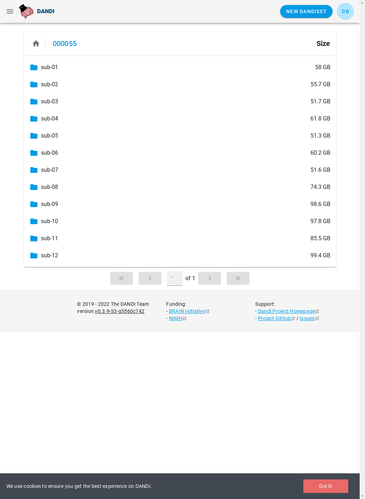

### 000001

| t=1.15 | t=0.57 |
| --- | --- |
|  |  |

### 000002

| t=1.15 | t=0.56 |
| --- | --- |
|  |  |

### 000003

| t=1.15 | t=0.56 |
| --- | --- |
|  |  |

### 000004

| t=1.13 | t=0.54 |
| --- | --- |
|  |  |

### 000005

| t=1.07 | t=0.56 |
| --- | --- |
|  |  |

### 000006

| t=1.07 | t=0.55 |
| --- | --- |
|  |  |

### 000007

| t=1.07 | t=0.55 |
| --- | --- |
|  |  |

### 000008

| t=1.12 | t=0.55 |
| --- | --- |
|  |  |

### 000009

| t=0.59 | t=0.55 |
| --- | --- |
|  |  |

### 000010

| t=0.56 | t=0.55 |
| --- | --- |
|  |  |

### 000011

| t=0.61 | t=0.55 |
| --- | --- |
|  |  |

### 000012

| t=1.11 | t=0.55 |
| --- | --- |
|  |  |

### 000013

| t=1.07 | t=0.55 |
| --- | --- |
|  |  |

### 000015

| t=1.11 | t=0.55 |
| --- | --- |
|  |  |

### 000016

| t=1.07 | t=0.55 |
| --- | --- |
|  |  |

### 000017

| t=1.07 | t=0.55 |
| --- | --- |
|  |  |

### 000018

| t=1.12 | t=0.55 |
| --- | --- |
|  |  |

### 000019

| t=1.05 | t=0.54 |
| --- | --- |
|  |  |

### 000020

| t=1.07 | t=0.55 |
| --- | --- |
|  |  |

### 000021

| t=1.07 | t=0.55 |
| --- | --- |
|  |  |

### 000022

| t=1.11 | t=0.54 |
| --- | --- |
|  |  |

### 000023

| t=1.11 | t=0.53 |
| --- | --- |
|  |  |

### 000024

| t=1.08 | t=0.55 |
| --- | --- |
|  |  |

### 000025

| t=1.66 | t=0.55 |
| --- | --- |
|  |  |

### 000026

| t=1.10 | t=0.55 |
| --- | --- |
|  |  |

### 000027

| t=1.07 | t=0.55 |
| --- | --- |
|  |  |

### 000028

| t=1.11 | t=0.55 |
| --- | --- |
|  |  |

### 000029

| t=0.63 | t=0.55 |
| --- | --- |
|  |  |

### 000030

| t=1.09 | t=0.55 |
| --- | --- |
|  |  |

### 000031

| t=1.09 | t=0.55 |
| --- | --- |
|  |  |

### 000032

| t=1.68 | t=0.55 |
| --- | --- |
|  |  |

### 000033

| t=1.63 | t=0.55 |
| --- | --- |
|  |  |

### 000034

| t=1.10 | t=0.55 |
| --- | --- |
|  |  |

### 000035

| t=1.66 | t=0.54 |
| --- | --- |
|  |  |

### 000036

| t=1.66 | t=0.56 |
| --- | --- |
|  |  |

### 000037

| t=1.11 | t=0.56 |
| --- | --- |
|  |  |

### 000038

| t=1.08 | t=0.55 |
| --- | --- |
|  |  |

### 000039

| t=1.11 | t=0.55 |
| --- | --- |
|  |  |

### 000040

| t=1.10 | t=0.55 |
| --- | --- |
|  |  |

### 000041

| t=1.12 | t=0.55 |
| --- | --- |
|  |  |

### 000042

| t=1.67 | t=0.55 |
| --- | --- |
|  |  |

### 000043

| t=0.62 | t=0.55 |
| --- | --- |
|  |  |

### 000044

| t=2.80 | t=0.55 |
| --- | --- |
|  |  |

### 000045

| t=1.11 | t=0.55 |
| --- | --- |
|  |  |

### 000046

| t=1.11 | t=1.07 |
| --- | --- |
|  |  |

### 000047

| t=1.11 | t=0.54 |
| --- | --- |
|  |  |

### 000048

| t=1.56 | t=0.55 |
| --- | --- |
|  |  |

### 000049

| t=1.08 | t=0.55 |
| --- | --- |
|  |  |

### 000050

| t=1.11 | t=0.55 |
| --- | --- |
|  |  |

### 000051

| t=1.09 | t=0.56 |
| --- | --- |
|  |  |

### 000052

| t=1.13 | t=0.55 |
| --- | --- |
|  |  |

### 000053

| t=1.63 | t=0.55 |
| --- | --- |
|  |  |

### 000054

| t=1.11 | t=0.55 |
| --- | --- |
|  |  |

### 000055

| t=1.11 | t=0.54 |
| --- | --- |
|  |  |

### 000056

| t=1.11 | t=1.66 |
| --- | --- |
|  |  |

### 000057

| t=1.11 | t=0.55 |
| --- | --- |
|  |  |

### 000058

| t=0.62 | t=0.55 |
| --- | --- |
|  |  |

### 001000

| t=1.06 | t=0.55 |
| --- | --- |
|  |  |

### 001001

| t=1.16 | t=0.55 |
| --- | --- |
|  |  |

### 001002

| t=1.10 | t=0.54 |
| --- | --- |
|  |  |

### 001003

| t=1.07 | t=0.55 |
| --- | --- |
|  |  |

### 001004

| t=1.10 | t=0.55 |
| --- | --- |
|  |  |

### 001005

| t=0.60 | t=0.55 |
| --- | --- |
|  |  |

### 001006

| t=1.63 | t=0.56 |
| --- | --- |
|  |  |

### 001007

| t=1.11 | t=0.56 |
| --- | --- |
|  |  |

### 001008

| t=1.08 | t=0.55 |
| --- | --- |
|  |  |

### 001009

| t=1.07 | t=0.55 |
| --- | --- |
|  |  |

### 001234

| t=1.11 | t=0.55 |
| --- | --- |
|  |  |

