| Page | Min Time | Mean ± StdDev | Max Time | Errors |
| --- | --- | --- | --- | --- |
| landing | 0.05s ([000003](#000003)) | 1.65s ± 0.74s | 5.58s ([000044](#000044)) | — |
| edit-metadata | 0.37s ([000068](#000068)) | 2.16s ± 4.51s | 36.04s ([000026](#000026)) | — |
| view-data | 0.30s ([000069](#000069)) | 0.65s ± 0.49s | 3.30s ([000026](#000026)) | — |

### 000003

| t=0.05 [Go to page](https://gui.dandiarchive.org/#/dandiset/000003) | t=1.86 Edit Metadata | t=0.47 [Go to page](https://gui.dandiarchive.org/#/dandiset/000003/draft/files) |
| --- | --- | --- |
|  | 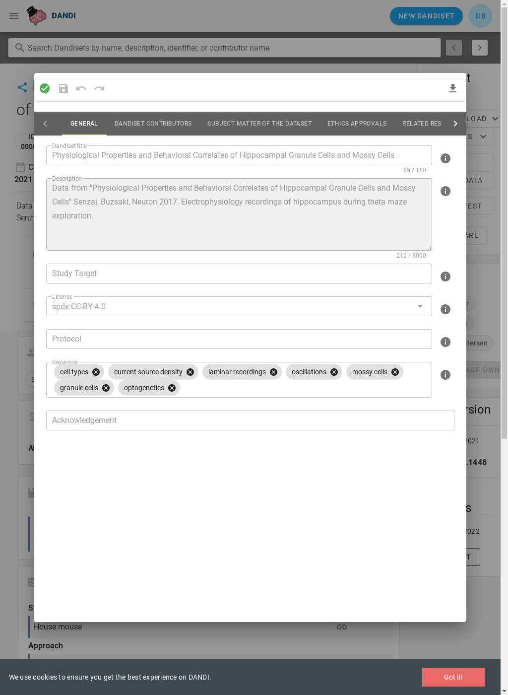 | 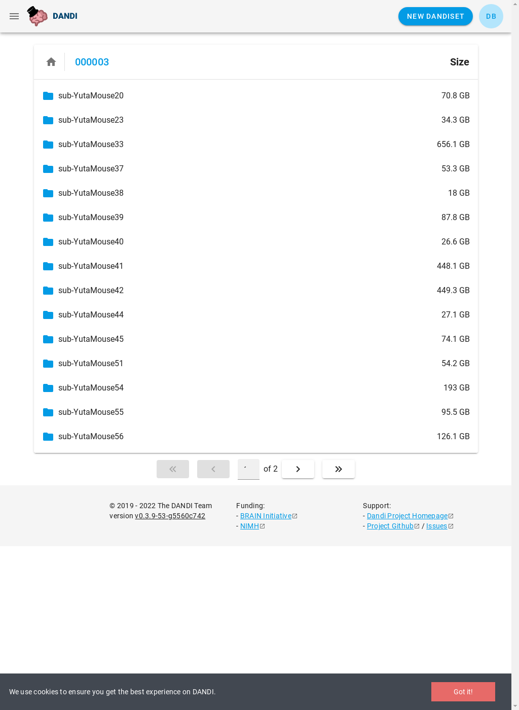 |

### 000004

| t=1.47 [Go to page](https://gui.dandiarchive.org/#/dandiset/000004) | t=14.13 Edit Metadata | t=1.09 [Go to page](https://gui.dandiarchive.org/#/dandiset/000004/draft/files) |
| --- | --- | --- |
|  |  |  |

### 000005

| t=1.50 [Go to page](https://gui.dandiarchive.org/#/dandiset/000005) | t=2.74 Edit Metadata | t=0.69 [Go to page](https://gui.dandiarchive.org/#/dandiset/000005/draft/files) |
| --- | --- | --- |
|  | 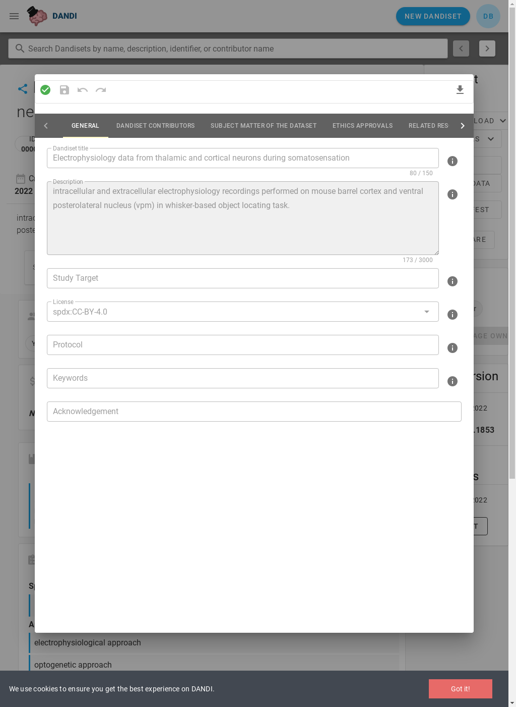 | 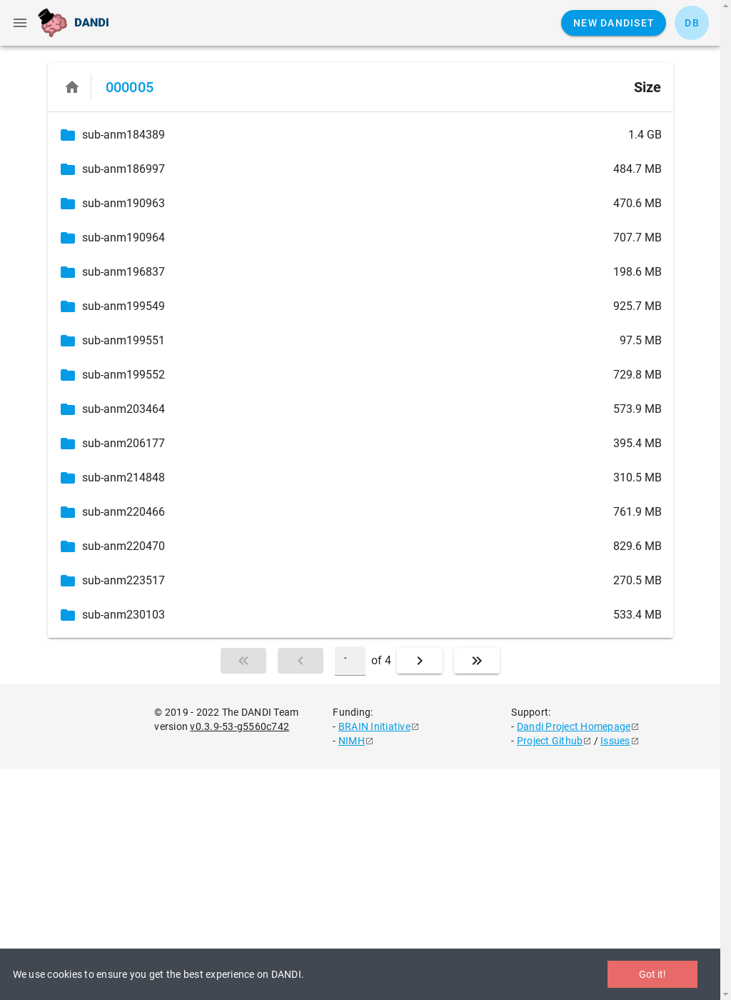 |

### 000006

| t=1.88 [Go to page](https://gui.dandiarchive.org/#/dandiset/000006) | t=1.11 Edit Metadata | t=0.42 [Go to page](https://gui.dandiarchive.org/#/dandiset/000006/draft/files) |
| --- | --- | --- |
|  |  | 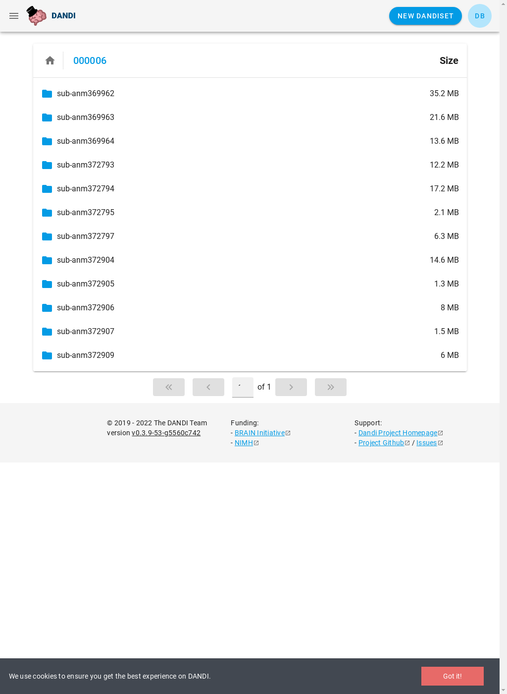 |

### 000007

| t=1.62 [Go to page](https://gui.dandiarchive.org/#/dandiset/000007) | t=2.82 Edit Metadata | t=0.40 [Go to page](https://gui.dandiarchive.org/#/dandiset/000007/draft/files) |
| --- | --- | --- |
|  | 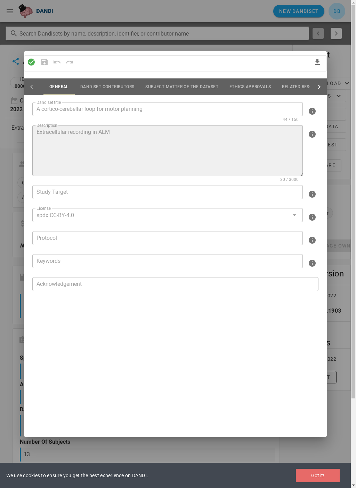 | 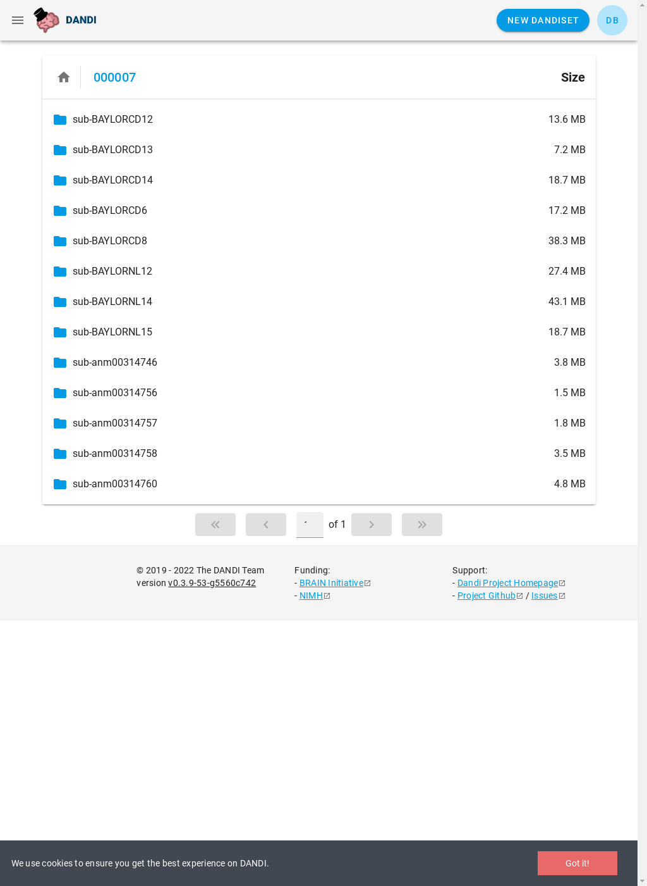 |

### 000008

| t=1.75 [Go to page](https://gui.dandiarchive.org/#/dandiset/000008) | t=6.00 Edit Metadata | t=1.17 [Go to page](https://gui.dandiarchive.org/#/dandiset/000008/draft/files) |
| --- | --- | --- |
| 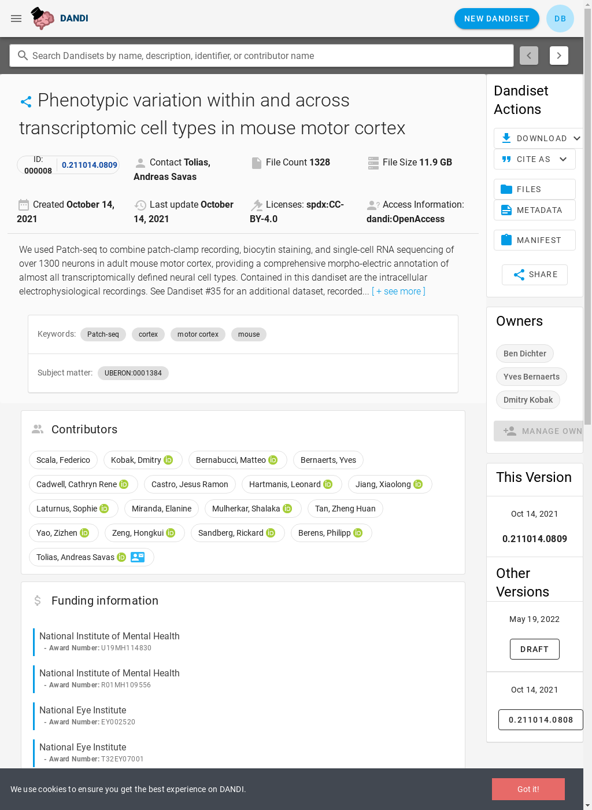 |  |  |

### 000009

| t=1.22 [Go to page](https://gui.dandiarchive.org/#/dandiset/000009) | t=2.27 Edit Metadata | t=0.47 [Go to page](https://gui.dandiarchive.org/#/dandiset/000009/draft/files) |
| --- | --- | --- |
|  | 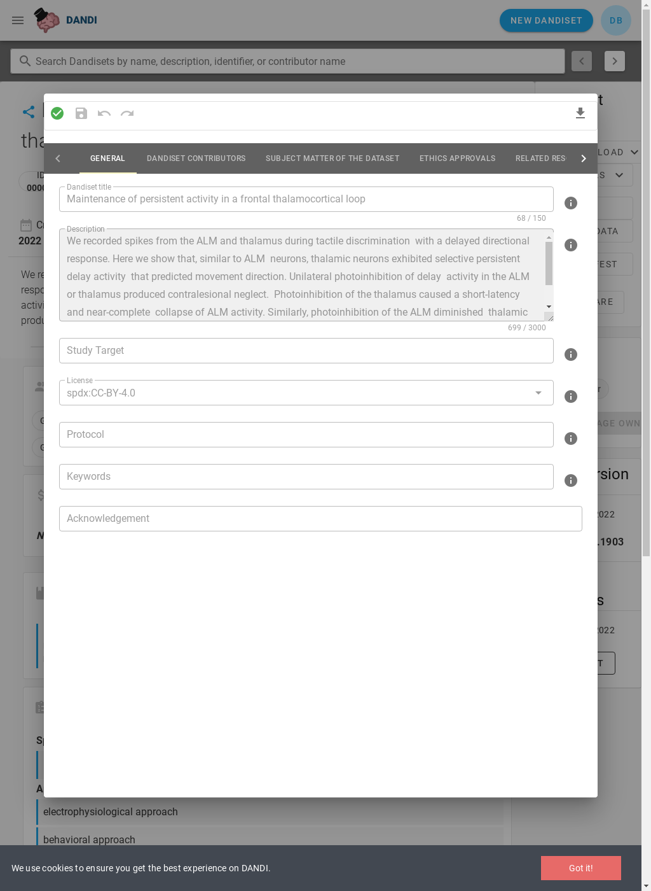 |  |

### 000010

| t=1.12 [Go to page](https://gui.dandiarchive.org/#/dandiset/000010) | t=1.97 Edit Metadata | t=0.62 [Go to page](https://gui.dandiarchive.org/#/dandiset/000010/draft/files) |
| --- | --- | --- |
| 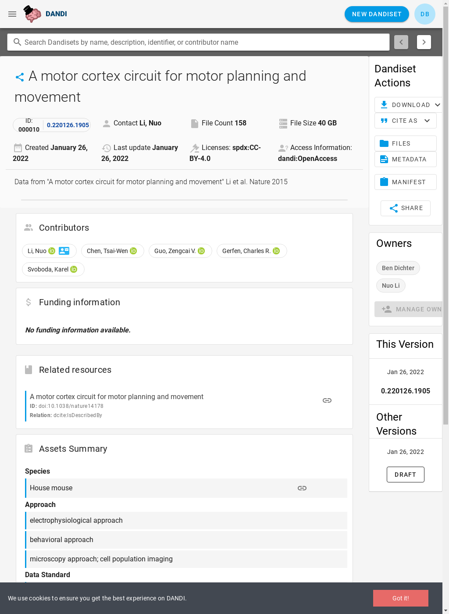 |  |  |

### 000011

| t=1.39 [Go to page](https://gui.dandiarchive.org/#/dandiset/000011) | t=2.60 Edit Metadata | t=0.62 [Go to page](https://gui.dandiarchive.org/#/dandiset/000011/draft/files) |
| --- | --- | --- |
|  |  |  |

### 000012

| t=1.08 [Go to page](https://gui.dandiarchive.org/#/dandiset/000012) | t=1.34 Edit Metadata | t=0.55 [Go to page](https://gui.dandiarchive.org/#/dandiset/000012/draft/files) |
| --- | --- | --- |
|  |  |  |

### 000013

| t=1.49 [Go to page](https://gui.dandiarchive.org/#/dandiset/000013) | t=2.00 Edit Metadata | t=0.44 [Go to page](https://gui.dandiarchive.org/#/dandiset/000013/draft/files) |
| --- | --- | --- |
|  | 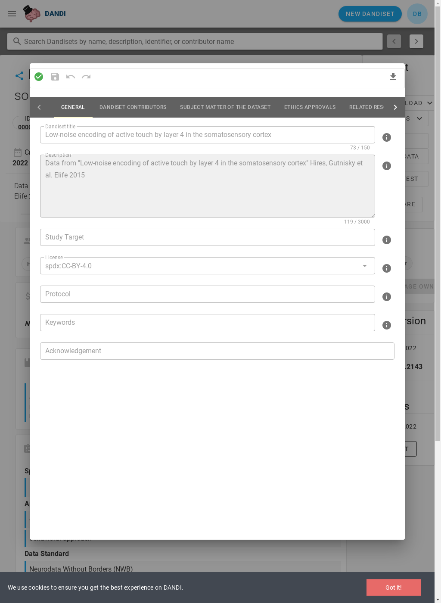 | 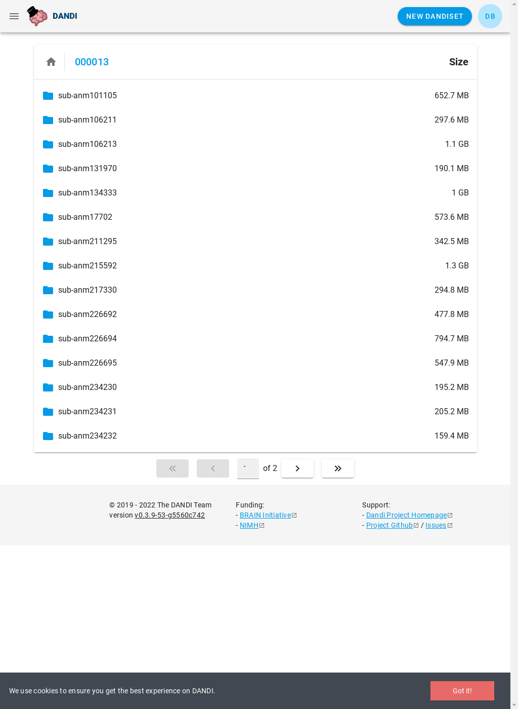 |

### 000015

| t=1.29 [Go to page](https://gui.dandiarchive.org/#/dandiset/000015) | t=1.60 Edit Metadata | t=0.56 [Go to page](https://gui.dandiarchive.org/#/dandiset/000015/draft/files) |
| --- | --- | --- |
|  | 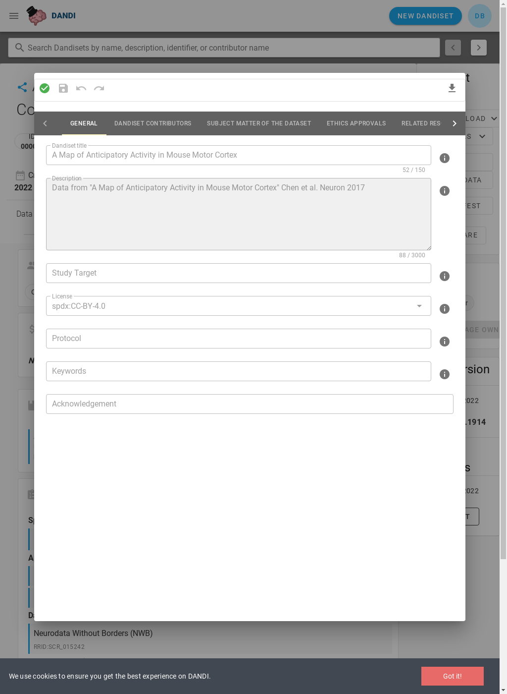 |  |

### 000016

| t=1.11 [Go to page](https://gui.dandiarchive.org/#/dandiset/000016) | t=1.31 Edit Metadata | t=0.55 [Go to page](https://gui.dandiarchive.org/#/dandiset/000016/draft/files) |
| --- | --- | --- |
|  |  |  |

### 000017

| t=1.12 [Go to page](https://gui.dandiarchive.org/#/dandiset/000017) | t=1.88 Edit Metadata | t=0.34 [Go to page](https://gui.dandiarchive.org/#/dandiset/000017/draft/files) |
| --- | --- | --- |
|  |  |  |

### 000018

| t=1.42 [Go to page](https://gui.dandiarchive.org/#/dandiset/000018) | t=1.67 Edit Metadata | t=0.46 [Go to page](https://gui.dandiarchive.org/#/dandiset/000018/draft/files) |
| --- | --- | --- |
|  |  |  |

### 000019

| t=1.52 [Go to page](https://gui.dandiarchive.org/#/dandiset/000019) | t=1.02 Edit Metadata | t=0.44 [Go to page](https://gui.dandiarchive.org/#/dandiset/000019/draft/files) |
| --- | --- | --- |
|  |  |  |

### 000020

| t=1.46 [Go to page](https://gui.dandiarchive.org/#/dandiset/000020) | t=0.49 Edit Metadata | t=2.63 [Go to page](https://gui.dandiarchive.org/#/dandiset/000020/draft/files) |
| --- | --- | --- |
|  | 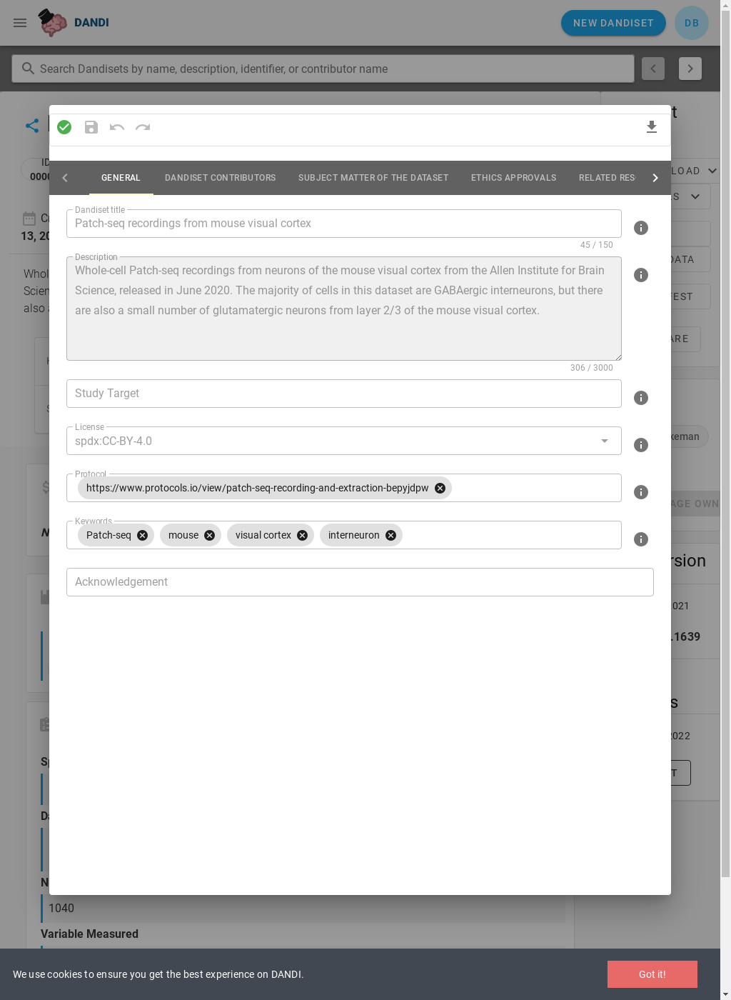 |  |

### 000021

| t=2.22 [Go to page](https://gui.dandiarchive.org/#/dandiset/000021) | t=4.62 Edit Metadata | t=0.90 [Go to page](https://gui.dandiarchive.org/#/dandiset/000021/draft/files) |
| --- | --- | --- |
|  | 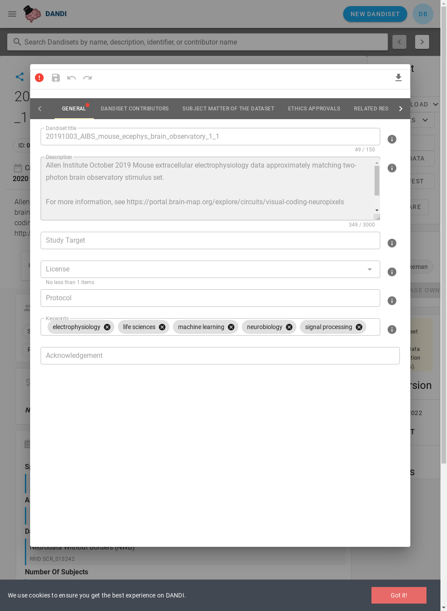 |  |

### 000022

| t=1.55 [Go to page](https://gui.dandiarchive.org/#/dandiset/000022) | t=4.50 Edit Metadata | t=0.64 [Go to page](https://gui.dandiarchive.org/#/dandiset/000022/draft/files) |
| --- | --- | --- |
|  |  |  |

### 000023

| t=1.72 [Go to page](https://gui.dandiarchive.org/#/dandiset/000023) | t=0.54 Edit Metadata | t=0.72 [Go to page](https://gui.dandiarchive.org/#/dandiset/000023/draft/files) |
| --- | --- | --- |
|  | 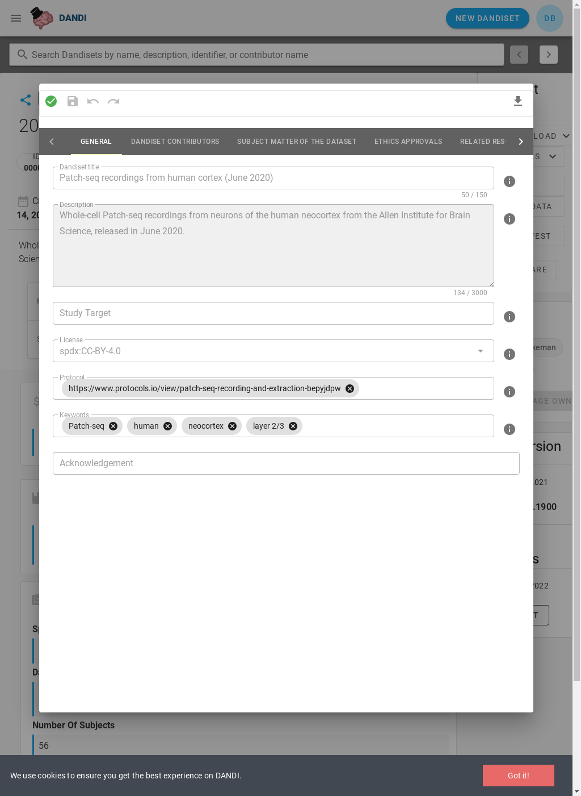 |  |

### 000024

| t=2.49 [Go to page](https://gui.dandiarchive.org/#/dandiset/000024) | t=0.53 Edit Metadata | t=0.52 [Go to page](https://gui.dandiarchive.org/#/dandiset/000024/draft/files) |
| --- | --- | --- |
| 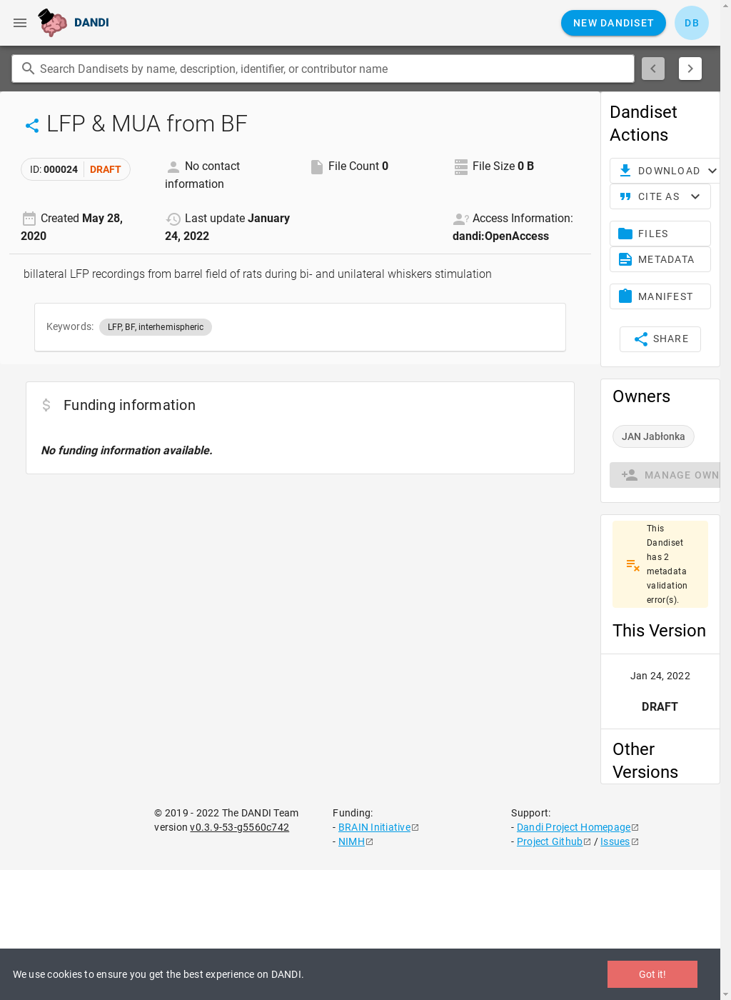 |  |  |

### 000025

| t=1.58 [Go to page](https://gui.dandiarchive.org/#/dandiset/000025) | t=0.48 Edit Metadata | t=0.41 [Go to page](https://gui.dandiarchive.org/#/dandiset/000025/draft/files) |
| --- | --- | --- |
|  | 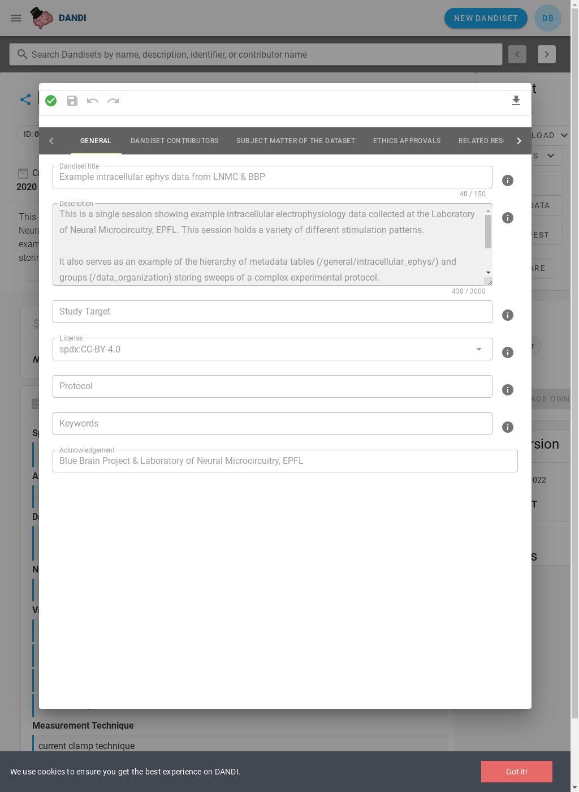 |  |

### 000026

| t=1.38 [Go to page](https://gui.dandiarchive.org/#/dandiset/000026) | t=36.04 Edit Metadata | t=3.30 [Go to page](https://gui.dandiarchive.org/#/dandiset/000026/draft/files) |
| --- | --- | --- |
|  |  |  |

### 000027

| t=0.94 [Go to page](https://gui.dandiarchive.org/#/dandiset/000027) | t=0.80 Edit Metadata | t=0.65 [Go to page](https://gui.dandiarchive.org/#/dandiset/000027/draft/files) |
| --- | --- | --- |
|  |  |  |

### 000028

| t=1.48 [Go to page](https://gui.dandiarchive.org/#/dandiset/000028) | t=0.50 Edit Metadata | t=0.52 [Go to page](https://gui.dandiarchive.org/#/dandiset/000028/draft/files) |
| --- | --- | --- |
|  |  |  |

### 000029

| t=1.16 [Go to page](https://gui.dandiarchive.org/#/dandiset/000029) | t=1.02 Edit Metadata | t=0.54 [Go to page](https://gui.dandiarchive.org/#/dandiset/000029/draft/files) |
| --- | --- | --- |
|  | 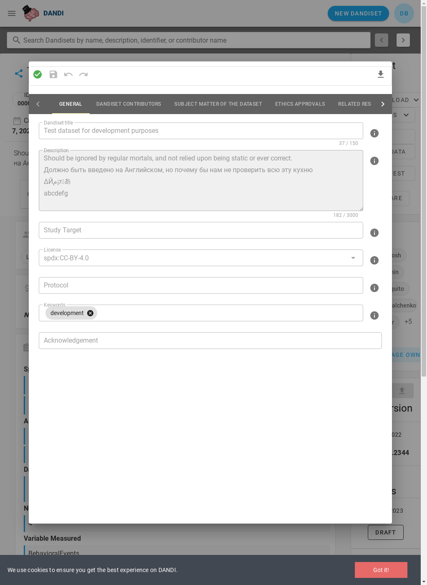 |  |

### 000030

| t=1.42 [Go to page](https://gui.dandiarchive.org/#/dandiset/000030) | t=0.55 Edit Metadata | t=0.40 [Go to page](https://gui.dandiarchive.org/#/dandiset/000030/draft/files) |
| --- | --- | --- |
|  |  |  |

### 000031

| t=1.81 [Go to page](https://gui.dandiarchive.org/#/dandiset/000031) | t=0.51 Edit Metadata | t=0.42 [Go to page](https://gui.dandiarchive.org/#/dandiset/000031/draft/files) |
| --- | --- | --- |
|  |  |  |

### 000032

| t=1.26 [Go to page](https://gui.dandiarchive.org/#/dandiset/000032) | t=0.52 Edit Metadata | t=0.52 [Go to page](https://gui.dandiarchive.org/#/dandiset/000032/draft/files) |
| --- | --- | --- |
|  |  |  |

### 000033

| t=1.16 [Go to page](https://gui.dandiarchive.org/#/dandiset/000033) | t=0.50 Edit Metadata | t=0.45 [Go to page](https://gui.dandiarchive.org/#/dandiset/000033/draft/files) |
| --- | --- | --- |
|  |  |  |

### 000034

| t=1.19 [Go to page](https://gui.dandiarchive.org/#/dandiset/000034) | t=2.79 Edit Metadata | t=0.71 [Go to page](https://gui.dandiarchive.org/#/dandiset/000034/draft/files) |
| --- | --- | --- |
|  |  |  |

### 000035

| t=1.66 [Go to page](https://gui.dandiarchive.org/#/dandiset/000035) | t=6.67 Edit Metadata | t=0.85 [Go to page](https://gui.dandiarchive.org/#/dandiset/000035/draft/files) |
| --- | --- | --- |
|  |  |  |

### 000036

| t=2.75 [Go to page](https://gui.dandiarchive.org/#/dandiset/000036) | t=0.86 Edit Metadata | t=1.03 [Go to page](https://gui.dandiarchive.org/#/dandiset/000036/draft/files) |
| --- | --- | --- |
|  |  |  |

### 000037

| t=3.80 [Go to page](https://gui.dandiarchive.org/#/dandiset/000037) | t=2.53 Edit Metadata | t=0.63 [Go to page](https://gui.dandiarchive.org/#/dandiset/000037/draft/files) |
| --- | --- | --- |
|  |  | 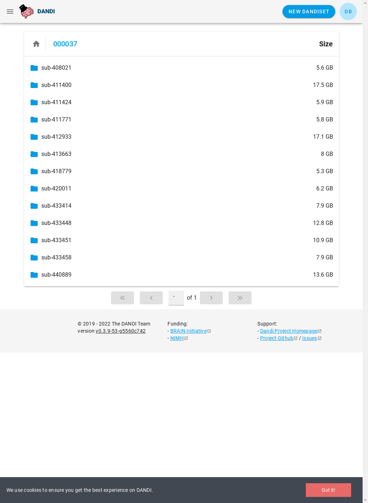 |

### 000038

| t=1.37 [Go to page](https://gui.dandiarchive.org/#/dandiset/000038) | t=0.49 Edit Metadata | t=0.40 [Go to page](https://gui.dandiarchive.org/#/dandiset/000038/draft/files) |
| --- | --- | --- |
|  |  |  |

### 000039

| t=1.57 [Go to page](https://gui.dandiarchive.org/#/dandiset/000039) | t=1.15 Edit Metadata | t=0.38 [Go to page](https://gui.dandiarchive.org/#/dandiset/000039/draft/files) |
| --- | --- | --- |
|  |  |  |

### 000040

| t=1.99 [Go to page](https://gui.dandiarchive.org/#/dandiset/000040) | t=1.72 Edit Metadata | t=0.55 [Go to page](https://gui.dandiarchive.org/#/dandiset/000040/draft/files) |
| --- | --- | --- |
|  | 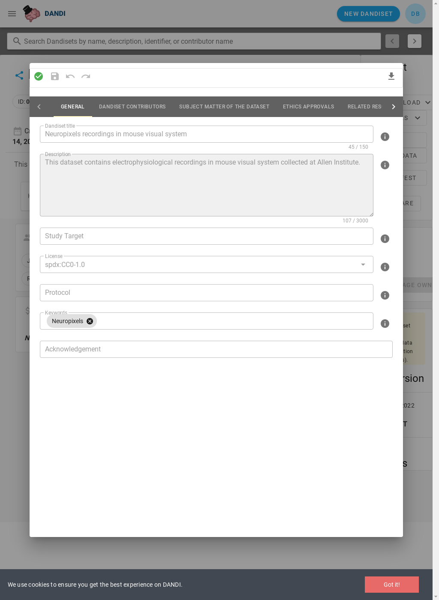 |  |

### 000041

| t=1.75 [Go to page](https://gui.dandiarchive.org/#/dandiset/000041) | t=1.96 Edit Metadata | t=1.16 [Go to page](https://gui.dandiarchive.org/#/dandiset/000041/draft/files) |
| --- | --- | --- |
|  |  |  |

### 000042

| t=2.66 [Go to page](https://gui.dandiarchive.org/#/dandiset/000042) | t=0.49 Edit Metadata | t=0.53 [Go to page](https://gui.dandiarchive.org/#/dandiset/000042/draft/files) |
| --- | --- | --- |
|  |  |  |

### 000043

| t=1.53 [Go to page](https://gui.dandiarchive.org/#/dandiset/000043) | t=1.66 Edit Metadata | t=0.68 [Go to page](https://gui.dandiarchive.org/#/dandiset/000043/draft/files) |
| --- | --- | --- |
|  |  |  |

### 000044

| t=5.58 [Go to page](https://gui.dandiarchive.org/#/dandiset/000044) | t=1.13 Edit Metadata | t=1.14 [Go to page](https://gui.dandiarchive.org/#/dandiset/000044/draft/files) |
| --- | --- | --- |
|  |  |  |

### 000045

| t=3.36 [Go to page](https://gui.dandiarchive.org/#/dandiset/000045) | t=0.91 Edit Metadata | t=2.32 [Go to page](https://gui.dandiarchive.org/#/dandiset/000045/draft/files) |
| --- | --- | --- |
|  |  |  |

### 000046

| t=0.84 [Go to page](https://gui.dandiarchive.org/#/dandiset/000046) | t=0.55 Edit Metadata | t=0.43 [Go to page](https://gui.dandiarchive.org/#/dandiset/000046/draft/files) |
| --- | --- | --- |
|  |  |  |

### 000047

| t=1.64 [Go to page](https://gui.dandiarchive.org/#/dandiset/000047) | t=0.59 Edit Metadata | t=0.46 [Go to page](https://gui.dandiarchive.org/#/dandiset/000047/draft/files) |
| --- | --- | --- |
|  |  |  |

### 000048

| t=1.59 [Go to page](https://gui.dandiarchive.org/#/dandiset/000048) | t=4.17 Edit Metadata | t=0.50 [Go to page](https://gui.dandiarchive.org/#/dandiset/000048/draft/files) |
| --- | --- | --- |
|  |  |  |

### 000049

| t=1.24 [Go to page](https://gui.dandiarchive.org/#/dandiset/000049) | t=0.77 Edit Metadata | t=0.43 [Go to page](https://gui.dandiarchive.org/#/dandiset/000049/draft/files) |
| --- | --- | --- |
| 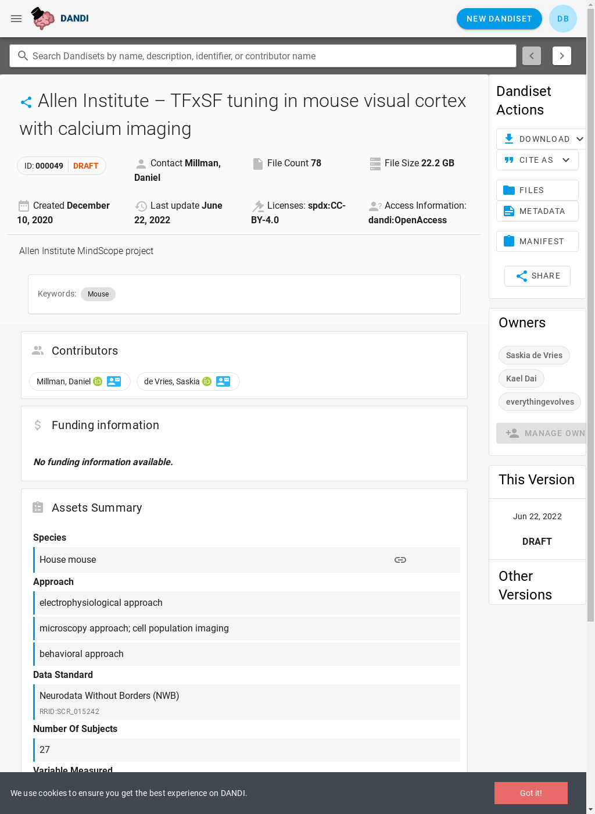 | 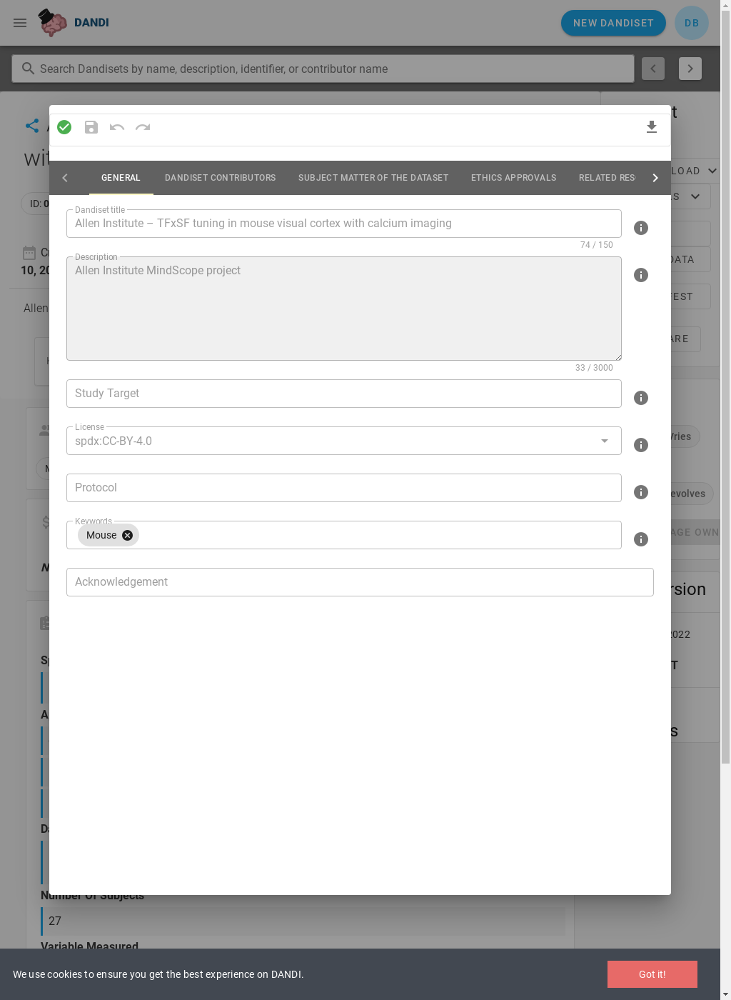 |  |

### 000050

| t=1.45 [Go to page](https://gui.dandiarchive.org/#/dandiset/000050) | t=0.52 Edit Metadata | t=0.67 [Go to page](https://gui.dandiarchive.org/#/dandiset/000050/draft/files) |
| --- | --- | --- |
|  |  |  |

### 000051

| t=1.18 [Go to page](https://gui.dandiarchive.org/#/dandiset/000051) | t=0.56 Edit Metadata | t=0.53 [Go to page](https://gui.dandiarchive.org/#/dandiset/000051/draft/files) |
| --- | --- | --- |
|  |  |  |

### 000052

| t=0.94 [Go to page](https://gui.dandiarchive.org/#/dandiset/000052) | t=0.67 Edit Metadata | t=0.34 [Go to page](https://gui.dandiarchive.org/#/dandiset/000052/draft/files) |
| --- | --- | --- |
| 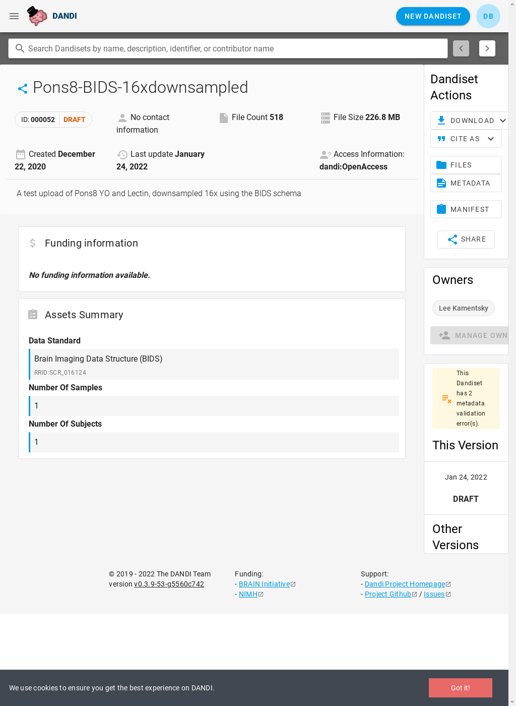 |  |  |

### 000053

| t=0.91 [Go to page](https://gui.dandiarchive.org/#/dandiset/000053) | t=4.23 Edit Metadata | t=0.55 [Go to page](https://gui.dandiarchive.org/#/dandiset/000053/draft/files) |
| --- | --- | --- |
|  |  |  |

### 000054

| t=1.13 [Go to page](https://gui.dandiarchive.org/#/dandiset/000054) | t=0.51 Edit Metadata | t=0.53 [Go to page](https://gui.dandiarchive.org/#/dandiset/000054/draft/files) |
| --- | --- | --- |
|  |  |  |

### 000055

| t=1.99 [Go to page](https://gui.dandiarchive.org/#/dandiset/000055) | t=1.89 Edit Metadata | t=0.58 [Go to page](https://gui.dandiarchive.org/#/dandiset/000055/draft/files) |
| --- | --- | --- |
|  |  |  |

### 000056

| t=2.08 [Go to page](https://gui.dandiarchive.org/#/dandiset/000056) | t=1.57 Edit Metadata | t=0.59 [Go to page](https://gui.dandiarchive.org/#/dandiset/000056/draft/files) |
| --- | --- | --- |
|  |  |  |

### 000057

| t=1.75 [Go to page](https://gui.dandiarchive.org/#/dandiset/000057) | t=0.54 Edit Metadata | t=0.53 [Go to page](https://gui.dandiarchive.org/#/dandiset/000057/draft/files) |
| --- | --- | --- |
|  |  |  |

### 000058

| t=1.46 [Go to page](https://gui.dandiarchive.org/#/dandiset/000058) | t=0.75 Edit Metadata | t=0.48 [Go to page](https://gui.dandiarchive.org/#/dandiset/000058/draft/files) |
| --- | --- | --- |
| 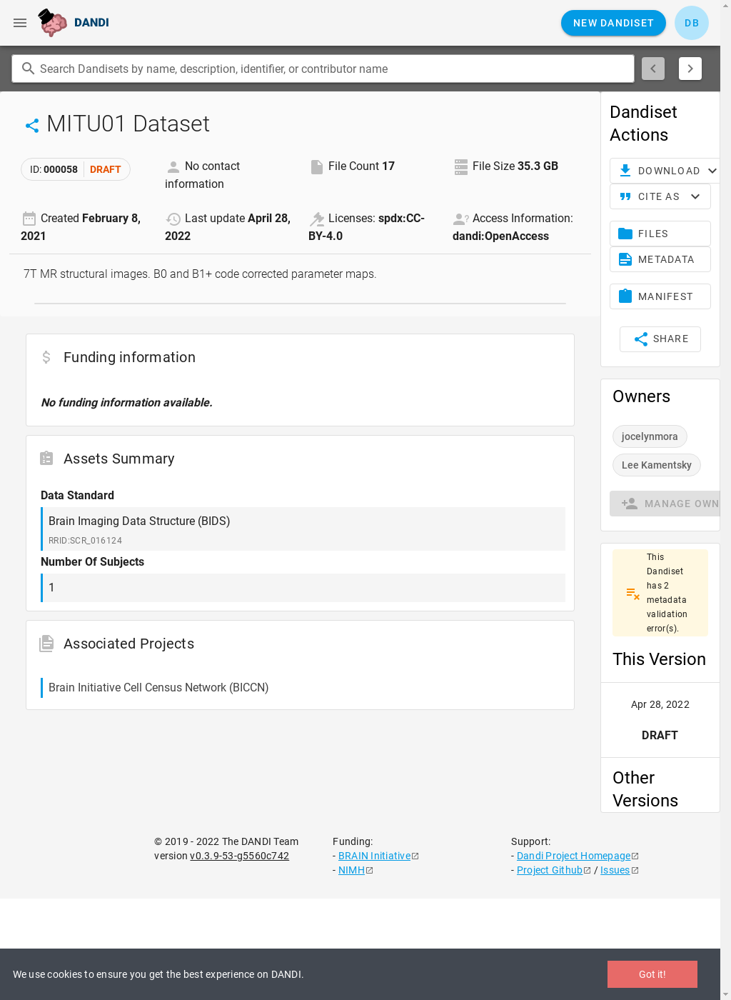 |  |  |

### 000059

| t=1.71 [Go to page](https://gui.dandiarchive.org/#/dandiset/000059) | t=1.35 Edit Metadata | t=0.32 [Go to page](https://gui.dandiarchive.org/#/dandiset/000059/draft/files) |
| --- | --- | --- |
|  |  |  |

### 000060

| t=1.21 [Go to page](https://gui.dandiarchive.org/#/dandiset/000060) | t=1.65 Edit Metadata | t=0.46 [Go to page](https://gui.dandiarchive.org/#/dandiset/000060/draft/files) |
| --- | --- | --- |
|  |  |  |

### 000061

| t=1.52 [Go to page](https://gui.dandiarchive.org/#/dandiset/000061) | t=1.32 Edit Metadata | t=0.58 [Go to page](https://gui.dandiarchive.org/#/dandiset/000061/draft/files) |
| --- | --- | --- |
|  |  |  |

### 000063

| t=1.51 [Go to page](https://gui.dandiarchive.org/#/dandiset/000063) | t=0.56 Edit Metadata | t=0.37 [Go to page](https://gui.dandiarchive.org/#/dandiset/000063/draft/files) |
| --- | --- | --- |
|  |  | 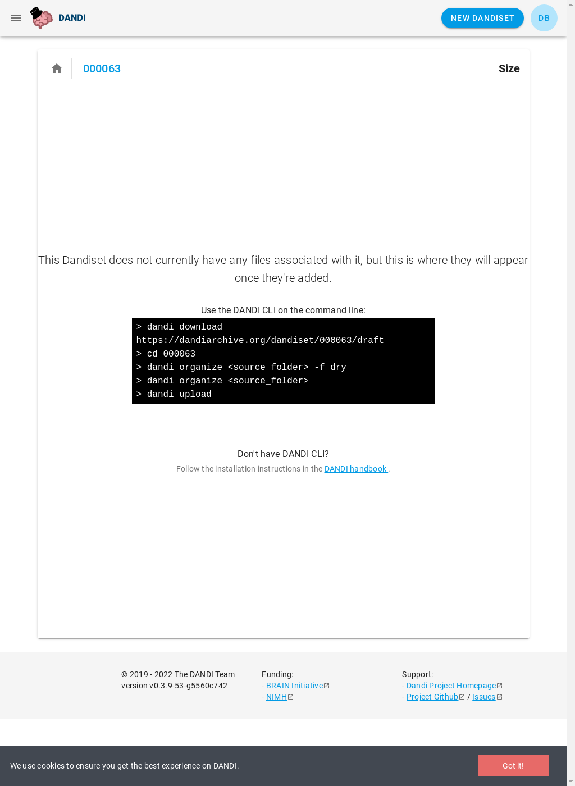 |

### 000064

| t=2.27 [Go to page](https://gui.dandiarchive.org/#/dandiset/000064) | t=0.64 Edit Metadata | t=0.61 [Go to page](https://gui.dandiarchive.org/#/dandiset/000064/draft/files) |
| --- | --- | --- |
| 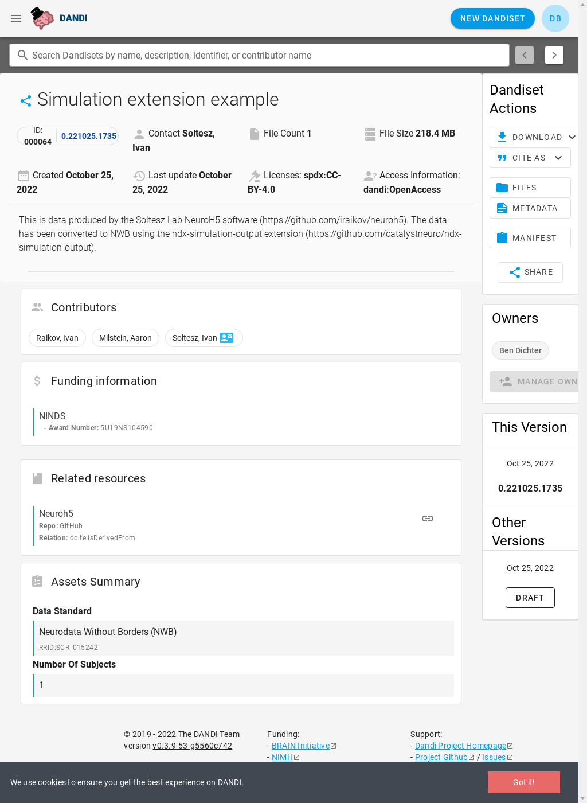 | 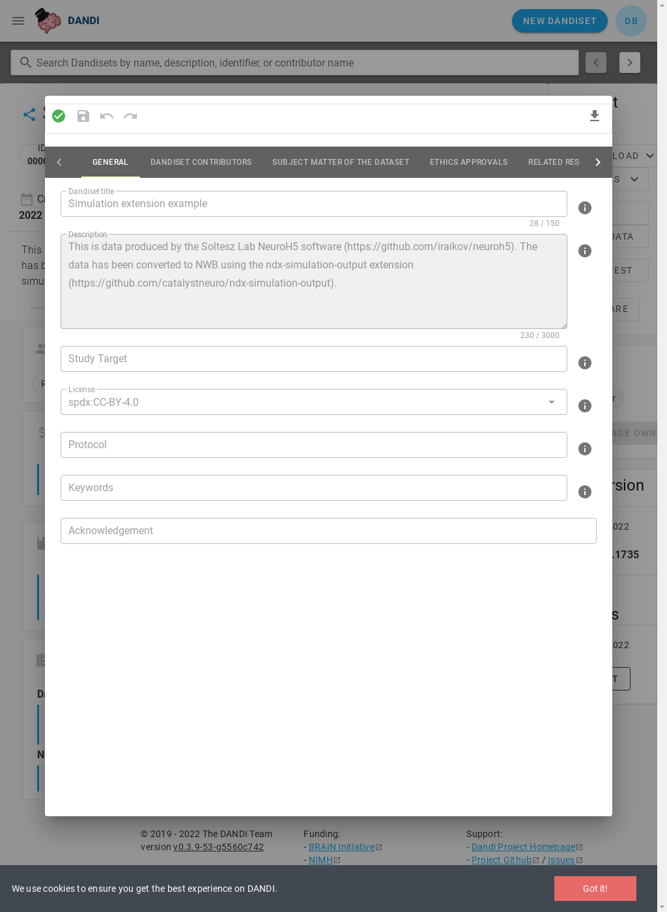 |  |

### 000065

| t=3.22 [Go to page](https://gui.dandiarchive.org/#/dandiset/000065) | t=0.64 Edit Metadata | t=0.47 [Go to page](https://gui.dandiarchive.org/#/dandiset/000065/draft/files) |
| --- | --- | --- |
| 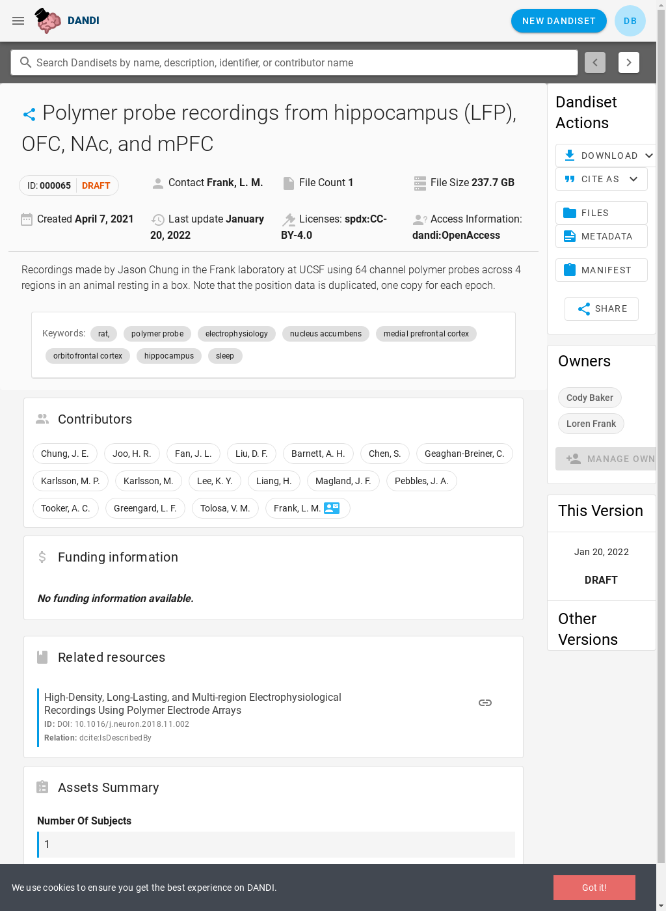 | 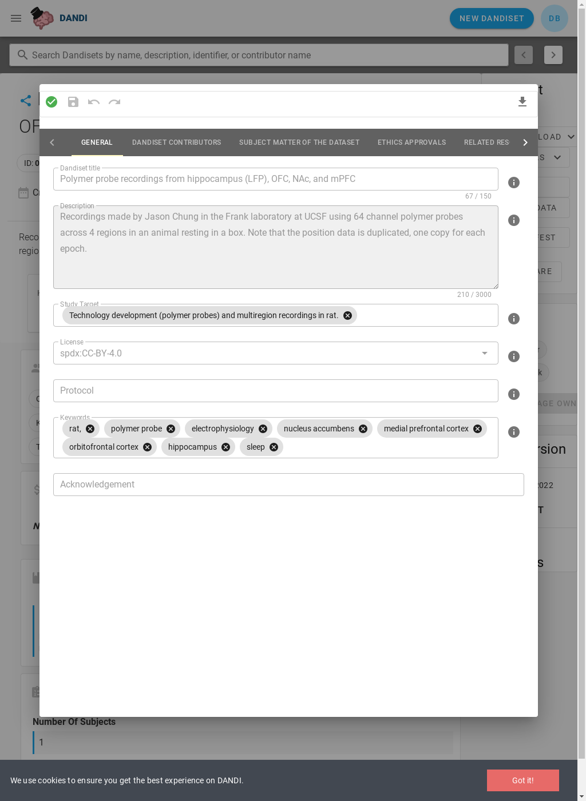 |  |

### 000066

| t=1.41 [Go to page](https://gui.dandiarchive.org/#/dandiset/000066) | t=0.82 Edit Metadata | t=0.65 [Go to page](https://gui.dandiarchive.org/#/dandiset/000066/draft/files) |
| --- | --- | --- |
|  | 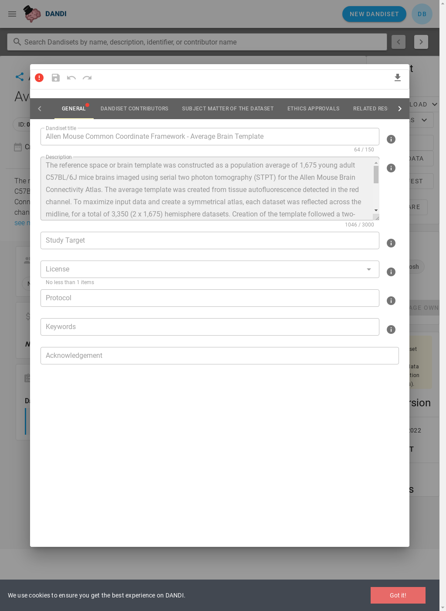 |  |

### 000067

| t=2.18 [Go to page](https://gui.dandiarchive.org/#/dandiset/000067) | t=1.56 Edit Metadata | t=0.57 [Go to page](https://gui.dandiarchive.org/#/dandiset/000067/draft/files) |
| --- | --- | --- |
|  |  |  |

### 000068

| t=1.63 [Go to page](https://gui.dandiarchive.org/#/dandiset/000068) | t=0.37 Edit Metadata | t=0.42 [Go to page](https://gui.dandiarchive.org/#/dandiset/000068/draft/files) |
| --- | --- | --- |
|  |  |  |

### 000069

| t=1.52 [Go to page](https://gui.dandiarchive.org/#/dandiset/000069) | t=0.41 Edit Metadata | t=0.30 [Go to page](https://gui.dandiarchive.org/#/dandiset/000069/draft/files) |
| --- | --- | --- |
|  |  |  |

### 000070

| t=1.85 [Go to page](https://gui.dandiarchive.org/#/dandiset/000070) | t=3.23 Edit Metadata | t=0.61 [Go to page](https://gui.dandiarchive.org/#/dandiset/000070/draft/files) |
| --- | --- | --- |
|  |  |  |

### 000071

| t=1.14 [Go to page](https://gui.dandiarchive.org/#/dandiset/000071) | t=0.39 Edit Metadata | t=0.52 [Go to page](https://gui.dandiarchive.org/#/dandiset/000071/draft/files) |
| --- | --- | --- |
|  |  |  |

### 000072

| t=1.27 [Go to page](https://gui.dandiarchive.org/#/dandiset/000072) | t=0.48 Edit Metadata | t=0.47 [Go to page](https://gui.dandiarchive.org/#/dandiset/000072/draft/files) |
| --- | --- | --- |
| 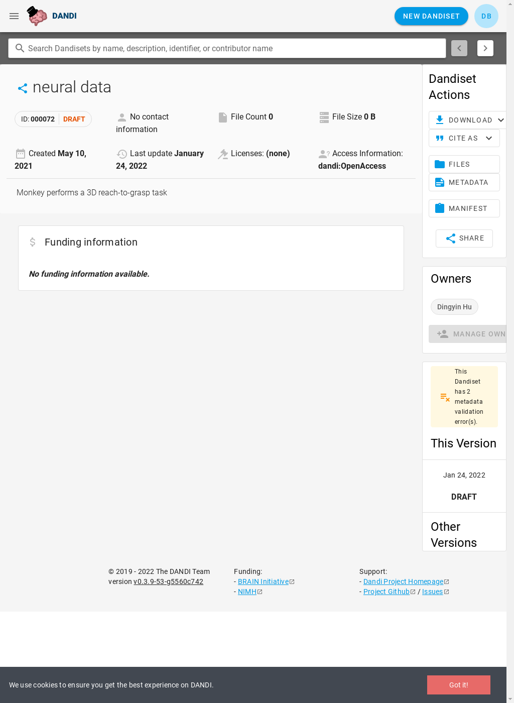 |  | 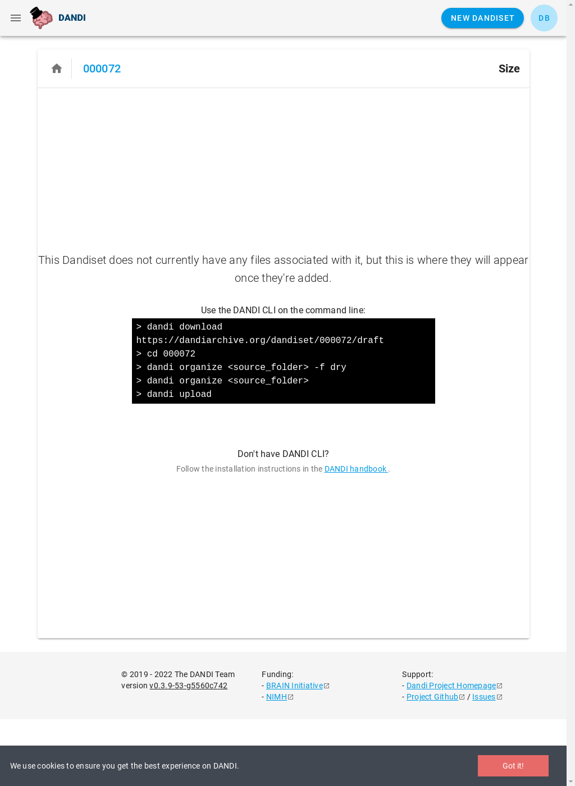 |

### 000105

| t=1.43 [Go to page](https://gui.dandiarchive.org/#/dandiset/000105) | t=1.06 Edit Metadata | t=0.36 [Go to page](https://gui.dandiarchive.org/#/dandiset/000105/draft/files) |
| --- | --- | --- |
| 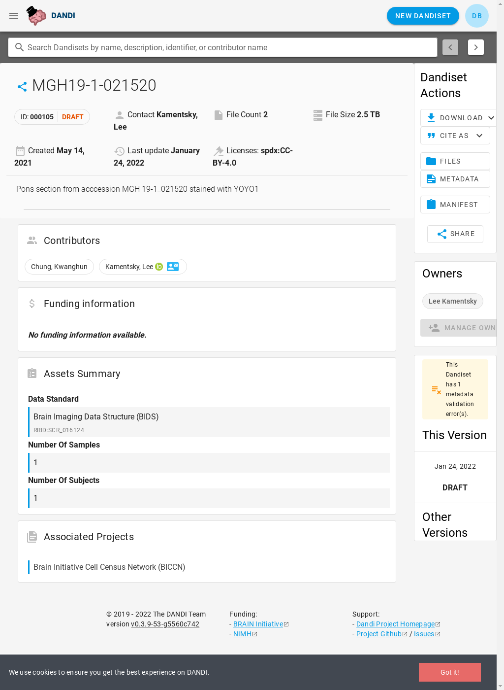 |  |  |

### 000106

| t=1.44 [Go to page](https://gui.dandiarchive.org/#/dandiset/000106) | t=0.39 Edit Metadata | t=0.42 [Go to page](https://gui.dandiarchive.org/#/dandiset/000106/draft/files) |
| --- | --- | --- |
|  |  | 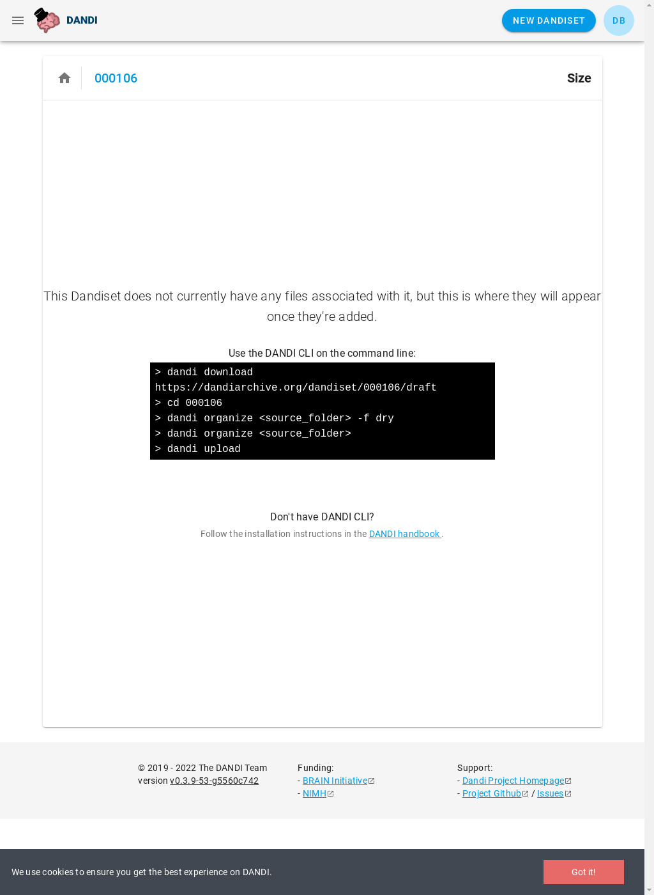 |

### 000107

| t=1.60 [Go to page](https://gui.dandiarchive.org/#/dandiset/000107) | t=0.59 Edit Metadata | t=0.46 [Go to page](https://gui.dandiarchive.org/#/dandiset/000107/draft/files) |
| --- | --- | --- |
|  |  |  |

