| Page | Min Time | Mean ± StdDev | Max Time | Errors |
| --- | --- | --- | --- | --- |
| landing | 0.63s ([000031](#000031)) | 1.19s ± 0.26s | 2.14s ([000035](#000035)) | [000041](#000041), [000042](#000042), [000043](#000043), [000044](#000044), [000045](#000045), [000046](#000046), [000047](#000047), [000048](#000048), [000049](#000049), [000050](#000050), [000051](#000051), [000052](#000052), [000053](#000053), [000054](#000054), [000055](#000055), [000056](#000056), [000057](#000057), [000058](#000058), [000059](#000059), [000060](#000060), [000061](#000061), [000063](#000063), [000064](#000064), [000065](#000065), [000066](#000066), [000067](#000067), [000068](#000068), [000069](#000069), [000070](#000070), [000071](#000071) |
| edit-metadata | 0.50s ([000032](#000032)) | 3.23s ± 6.24s | 36.94s ([000026](#000026)) | [000040](#000040), [000041](#000041), [000042](#000042), [000043](#000043), [000044](#000044), [000045](#000045), [000046](#000046), [000047](#000047), [000048](#000048), [000049](#000049), [000050](#000050), [000051](#000051), [000052](#000052), [000053](#000053), [000054](#000054), [000055](#000055), [000056](#000056), [000057](#000057), [000058](#000058), [000059](#000059), [000060](#000060), [000061](#000061), [000063](#000063), [000064](#000064), [000065](#000065), [000066](#000066), [000067](#000067), [000068](#000068), [000069](#000069), [000070](#000070), [000071](#000071) |
| view-data | 0.59s ([000023](#000023)) | 0.81s ± 0.52s | 3.21s ([000026](#000026)) | [000040](#000040), [000041](#000041), [000042](#000042), [000043](#000043), [000044](#000044), [000045](#000045), [000046](#000046), [000047](#000047), [000048](#000048), [000049](#000049), [000050](#000050), [000051](#000051), [000052](#000052), [000053](#000053), [000054](#000054), [000055](#000055), [000056](#000056), [000057](#000057), [000058](#000058), [000059](#000059), [000060](#000060), [000061](#000061), [000063](#000063), [000064](#000064), [000065](#000065), [000066](#000066), [000067](#000067), [000068](#000068), [000069](#000069), [000070](#000070), [000071](#000071) |

### 000003

| t=1.14 [Go to page](https://gui.dandiarchive.org/#/dandiset/000003) | t=1.91 Edit Metadata | t=0.63 [Go to page](https://gui.dandiarchive.org/#/dandiset/000003/draft/files) |
| --- | --- | --- |
|  |  |  |

### 000004

| t=1.14 [Go to page](https://gui.dandiarchive.org/#/dandiset/000004) | t=14.18 Edit Metadata | t=1.26 [Go to page](https://gui.dandiarchive.org/#/dandiset/000004/draft/files) |
| --- | --- | --- |
|  | 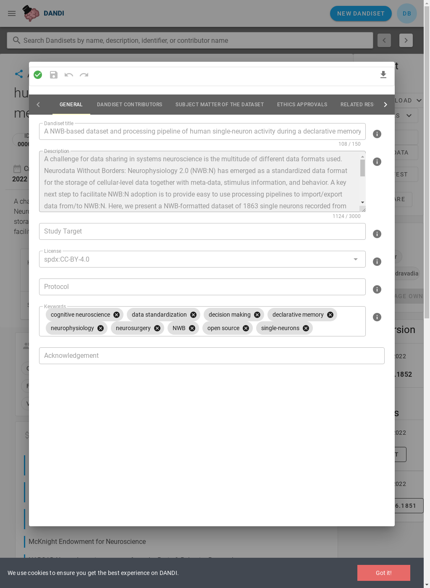 |  |

### 000005

| t=1.12 [Go to page](https://gui.dandiarchive.org/#/dandiset/000005) | t=2.79 Edit Metadata | t=0.68 [Go to page](https://gui.dandiarchive.org/#/dandiset/000005/draft/files) |
| --- | --- | --- |
| 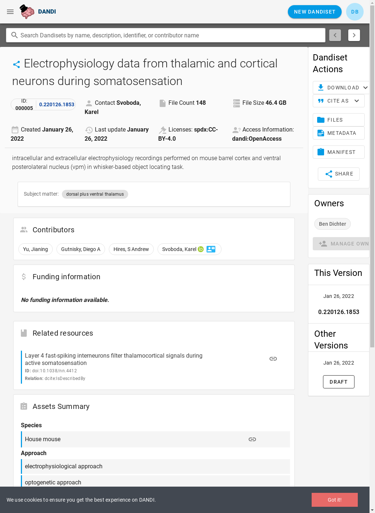 |  |  |

### 000006

| t=1.15 [Go to page](https://gui.dandiarchive.org/#/dandiset/000006) | t=1.31 Edit Metadata | t=0.63 [Go to page](https://gui.dandiarchive.org/#/dandiset/000006/draft/files) |
| --- | --- | --- |
|  |  |  |

### 000007

| t=1.17 [Go to page](https://gui.dandiarchive.org/#/dandiset/000007) | t=2.94 Edit Metadata | t=1.21 [Go to page](https://gui.dandiarchive.org/#/dandiset/000007/draft/files) |
| --- | --- | --- |
| 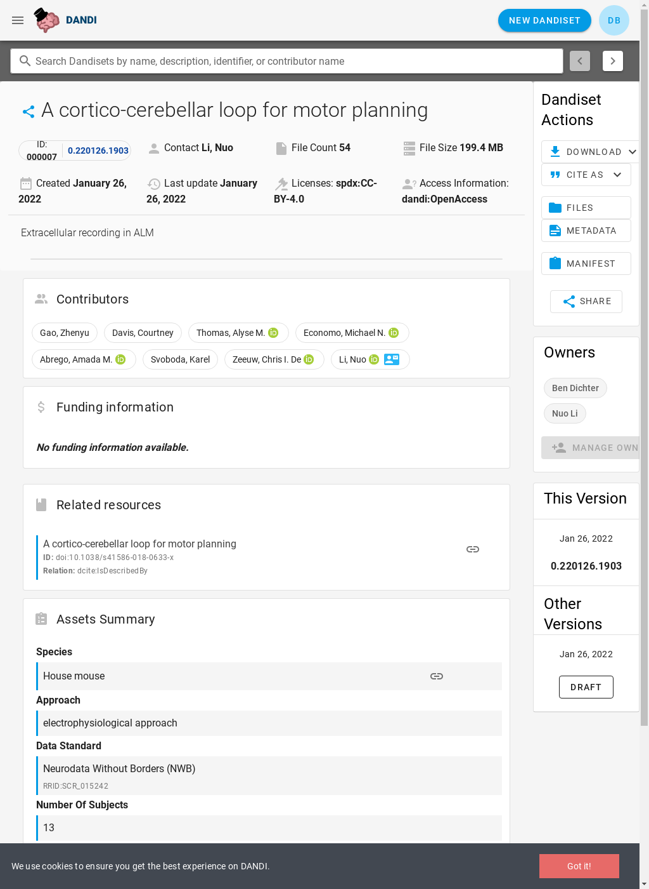 |  |  |

### 000008

| t=1.13 [Go to page](https://gui.dandiarchive.org/#/dandiset/000008) | t=6.30 Edit Metadata | t=1.05 [Go to page](https://gui.dandiarchive.org/#/dandiset/000008/draft/files) |
| --- | --- | --- |
|  |  |  |

### 000009

| t=1.24 [Go to page](https://gui.dandiarchive.org/#/dandiset/000009) | t=2.34 Edit Metadata | t=0.70 [Go to page](https://gui.dandiarchive.org/#/dandiset/000009/draft/files) |
| --- | --- | --- |
|  |  |  |

### 000010

| t=1.16 [Go to page](https://gui.dandiarchive.org/#/dandiset/000010) | t=2.27 Edit Metadata | t=0.65 [Go to page](https://gui.dandiarchive.org/#/dandiset/000010/draft/files) |
| --- | --- | --- |
|  |  |  |

### 000011

| t=1.15 [Go to page](https://gui.dandiarchive.org/#/dandiset/000011) | t=2.53 Edit Metadata | t=0.68 [Go to page](https://gui.dandiarchive.org/#/dandiset/000011/draft/files) |
| --- | --- | --- |
|  | 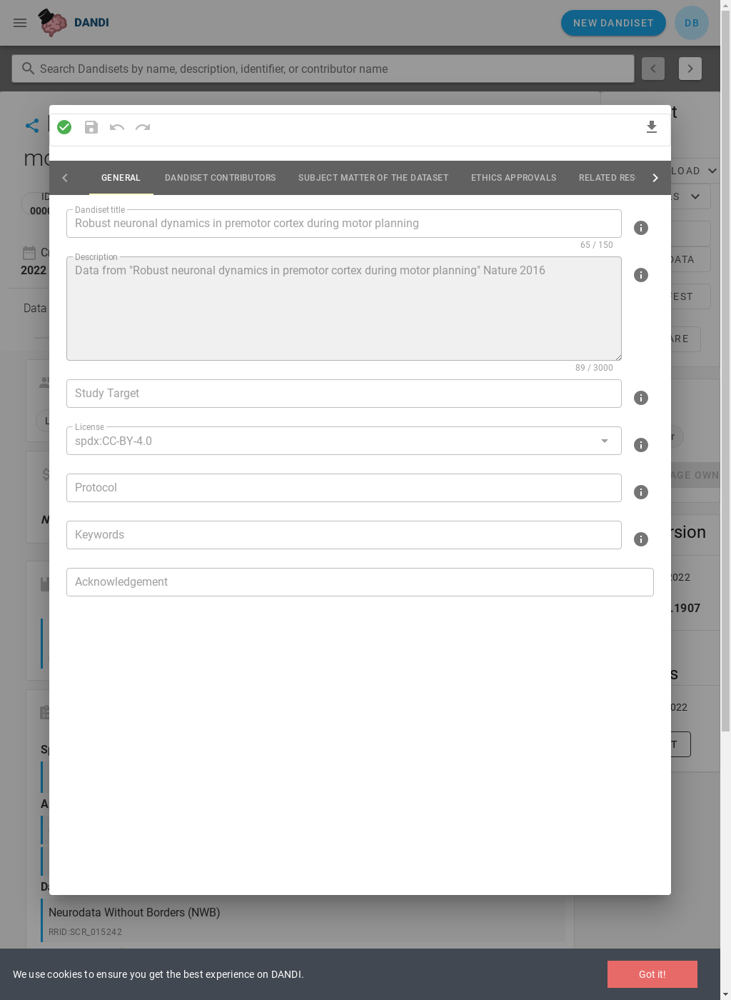 |  |

### 000012

| t=1.21 [Go to page](https://gui.dandiarchive.org/#/dandiset/000012) | t=1.44 Edit Metadata | t=0.64 [Go to page](https://gui.dandiarchive.org/#/dandiset/000012/draft/files) |
| --- | --- | --- |
|  |  |  |

### 000013

| t=1.14 [Go to page](https://gui.dandiarchive.org/#/dandiset/000013) | t=2.03 Edit Metadata | t=0.65 [Go to page](https://gui.dandiarchive.org/#/dandiset/000013/draft/files) |
| --- | --- | --- |
|  |  |  |

### 000015

| t=0.68 [Go to page](https://gui.dandiarchive.org/#/dandiset/000015) | t=1.68 Edit Metadata | t=0.65 [Go to page](https://gui.dandiarchive.org/#/dandiset/000015/draft/files) |
| --- | --- | --- |
|  |  |  |

### 000016

| t=1.19 [Go to page](https://gui.dandiarchive.org/#/dandiset/000016) | t=1.31 Edit Metadata | t=0.62 [Go to page](https://gui.dandiarchive.org/#/dandiset/000016/draft/files) |
| --- | --- | --- |
|  | 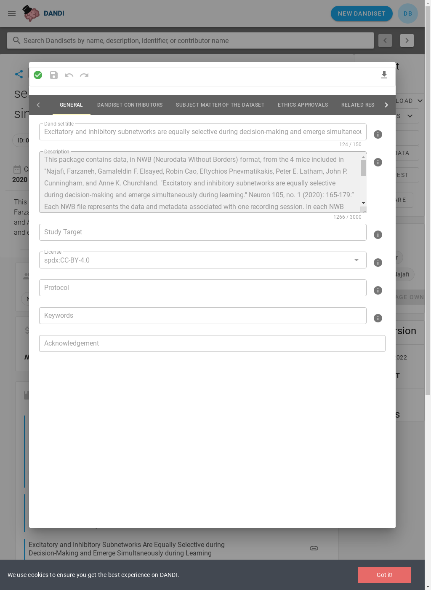 |  |

### 000017

| t=1.10 [Go to page](https://gui.dandiarchive.org/#/dandiset/000017) | t=2.07 Edit Metadata | t=0.64 [Go to page](https://gui.dandiarchive.org/#/dandiset/000017/draft/files) |
| --- | --- | --- |
|  | 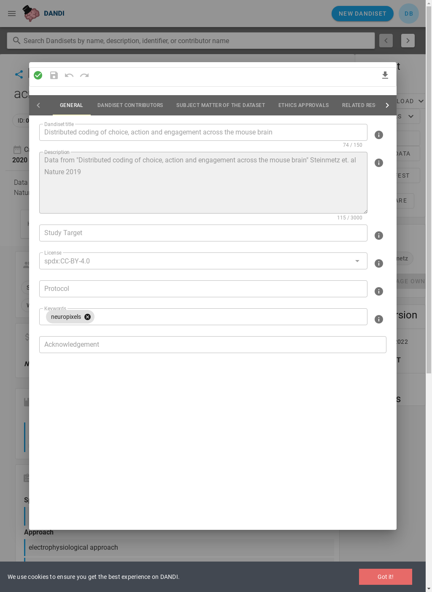 |  |

### 000018

| t=1.10 [Go to page](https://gui.dandiarchive.org/#/dandiset/000018) | t=1.88 Edit Metadata | t=0.66 [Go to page](https://gui.dandiarchive.org/#/dandiset/000018/draft/files) |
| --- | --- | --- |
|  | 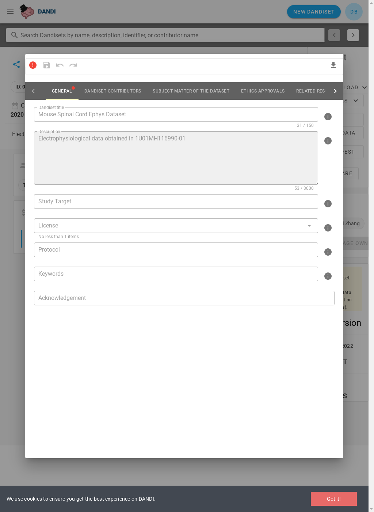 | 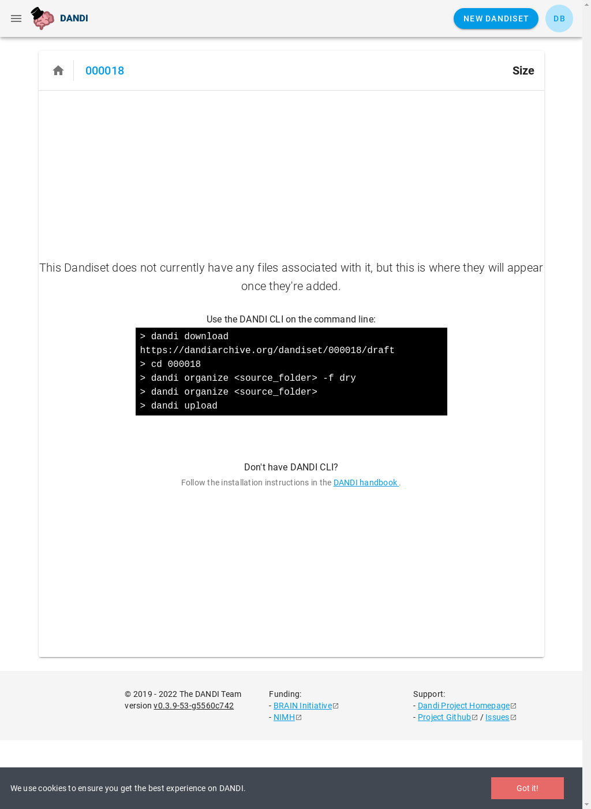 |

### 000019

| t=1.12 [Go to page](https://gui.dandiarchive.org/#/dandiset/000019) | t=1.04 Edit Metadata | t=0.61 [Go to page](https://gui.dandiarchive.org/#/dandiset/000019/draft/files) |
| --- | --- | --- |
|  |  | 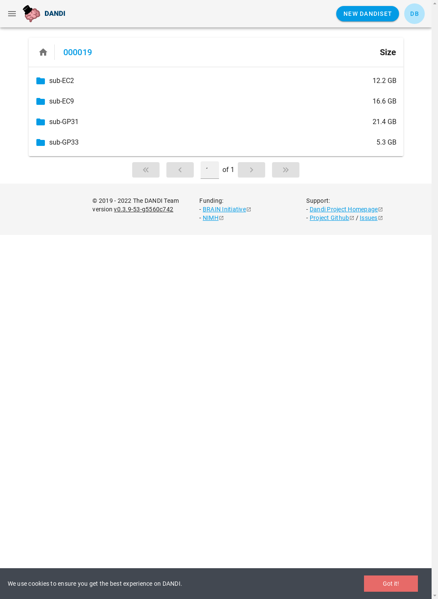 |

### 000020

| t=1.09 [Go to page](https://gui.dandiarchive.org/#/dandiset/000020) | t=0.60 Edit Metadata | t=2.45 [Go to page](https://gui.dandiarchive.org/#/dandiset/000020/draft/files) |
| --- | --- | --- |
|  |  |  |

### 000021

| t=1.92 [Go to page](https://gui.dandiarchive.org/#/dandiset/000021) | t=5.04 Edit Metadata | t=0.81 [Go to page](https://gui.dandiarchive.org/#/dandiset/000021/draft/files) |
| --- | --- | --- |
|  |  |  |

### 000022

| t=1.12 [Go to page](https://gui.dandiarchive.org/#/dandiset/000022) | t=4.60 Edit Metadata | t=0.79 [Go to page](https://gui.dandiarchive.org/#/dandiset/000022/draft/files) |
| --- | --- | --- |
|  |  |  |

### 000023

| t=1.10 [Go to page](https://gui.dandiarchive.org/#/dandiset/000023) | t=0.51 Edit Metadata | t=0.59 [Go to page](https://gui.dandiarchive.org/#/dandiset/000023/draft/files) |
| --- | --- | --- |
|  |  |  |

### 000024

| t=1.12 [Go to page](https://gui.dandiarchive.org/#/dandiset/000024) | t=0.54 Edit Metadata | t=0.60 [Go to page](https://gui.dandiarchive.org/#/dandiset/000024/draft/files) |
| --- | --- | --- |
|  | 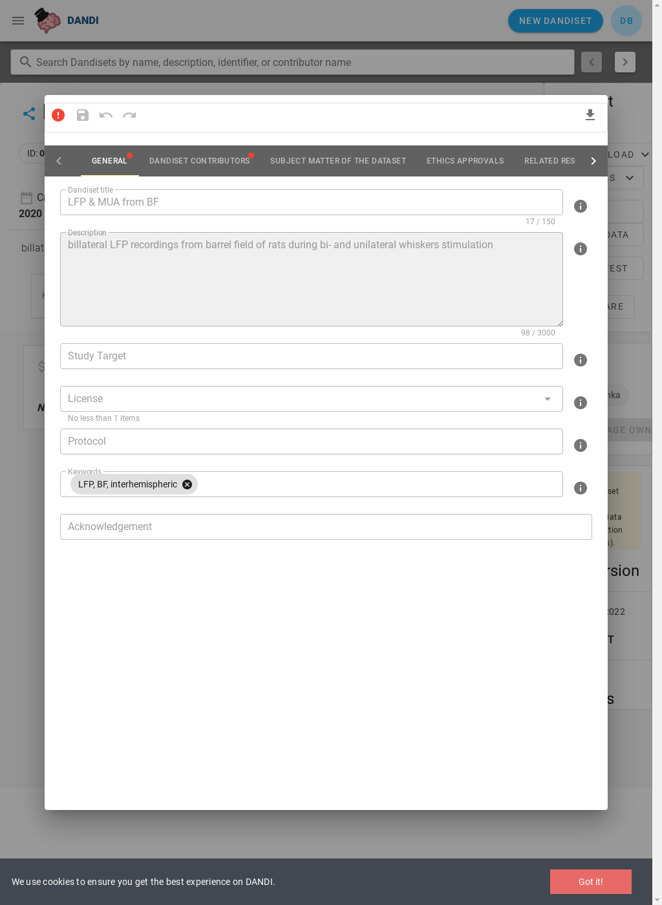 |  |

### 000025

| t=1.15 [Go to page](https://gui.dandiarchive.org/#/dandiset/000025) | t=0.54 Edit Metadata | t=0.60 [Go to page](https://gui.dandiarchive.org/#/dandiset/000025/draft/files) |
| --- | --- | --- |
|  |  |  |

### 000026

| t=1.26 [Go to page](https://gui.dandiarchive.org/#/dandiset/000026) | t=36.94 Edit Metadata | t=3.21 [Go to page](https://gui.dandiarchive.org/#/dandiset/000026/draft/files) |
| --- | --- | --- |
|  |  |  |

### 000027

| t=1.11 [Go to page](https://gui.dandiarchive.org/#/dandiset/000027) | t=0.86 Edit Metadata | t=0.63 [Go to page](https://gui.dandiarchive.org/#/dandiset/000027/draft/files) |
| --- | --- | --- |
|  |  |  |

### 000028

| t=1.17 [Go to page](https://gui.dandiarchive.org/#/dandiset/000028) | t=0.57 Edit Metadata | t=0.60 [Go to page](https://gui.dandiarchive.org/#/dandiset/000028/draft/files) |
| --- | --- | --- |
| 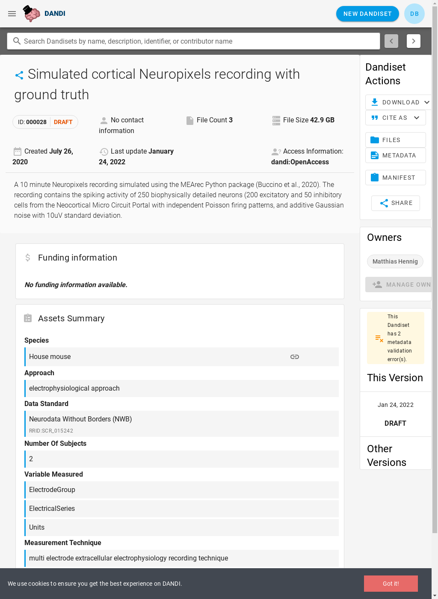 |  |  |

### 000029

| t=1.12 [Go to page](https://gui.dandiarchive.org/#/dandiset/000029) | t=0.90 Edit Metadata | t=0.62 [Go to page](https://gui.dandiarchive.org/#/dandiset/000029/draft/files) |
| --- | --- | --- |
|  |  | 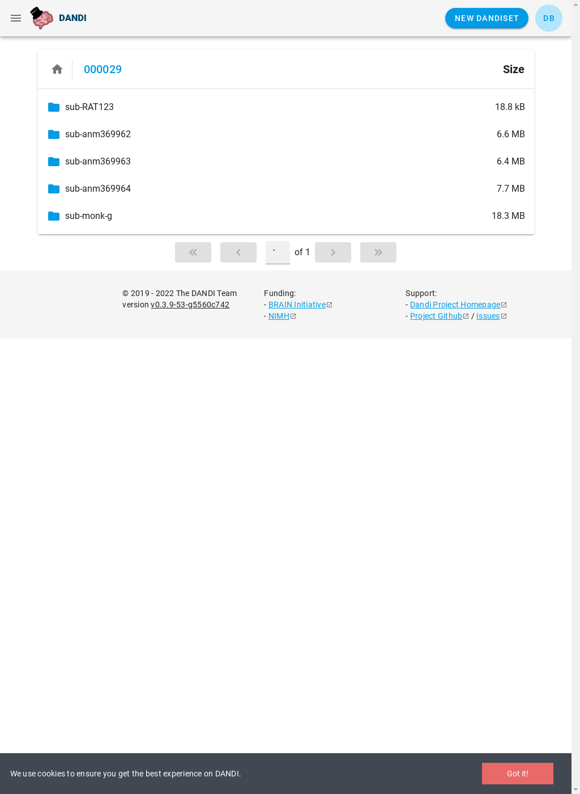 |

### 000030

| t=1.11 [Go to page](https://gui.dandiarchive.org/#/dandiset/000030) | t=0.55 Edit Metadata | t=0.59 [Go to page](https://gui.dandiarchive.org/#/dandiset/000030/draft/files) |
| --- | --- | --- |
|  | 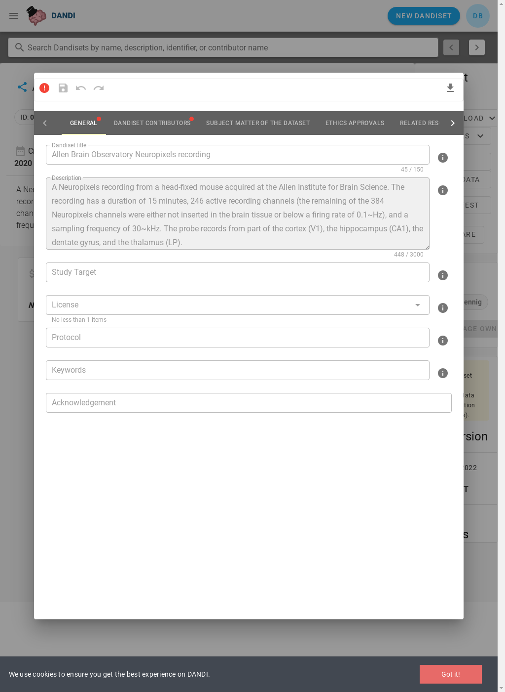 | 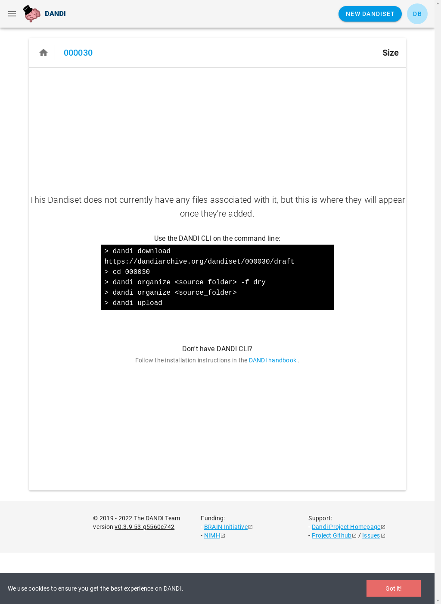 |

### 000031

| t=0.63 [Go to page](https://gui.dandiarchive.org/#/dandiset/000031) | t=0.52 Edit Metadata | t=0.60 [Go to page](https://gui.dandiarchive.org/#/dandiset/000031/draft/files) |
| --- | --- | --- |
|  |  | 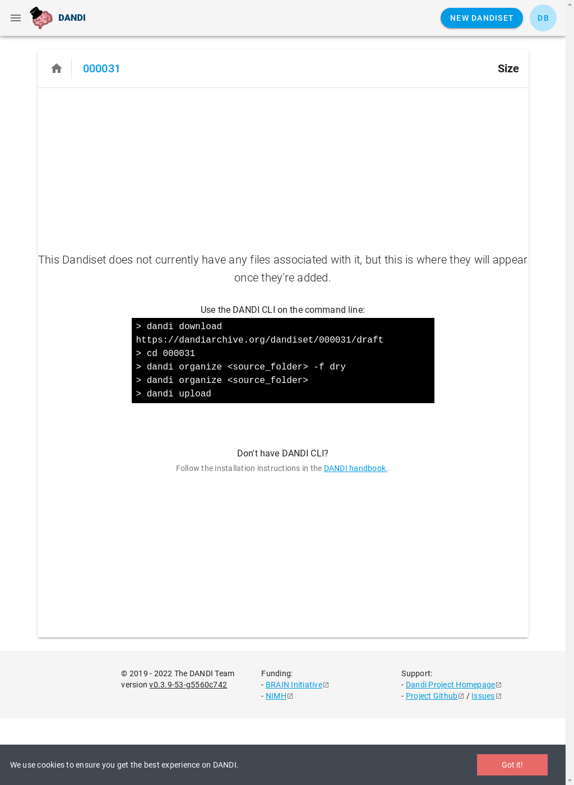 |

### 000032

| t=1.10 [Go to page](https://gui.dandiarchive.org/#/dandiset/000032) | t=0.50 Edit Metadata | t=0.60 [Go to page](https://gui.dandiarchive.org/#/dandiset/000032/draft/files) |
| --- | --- | --- |
|  | 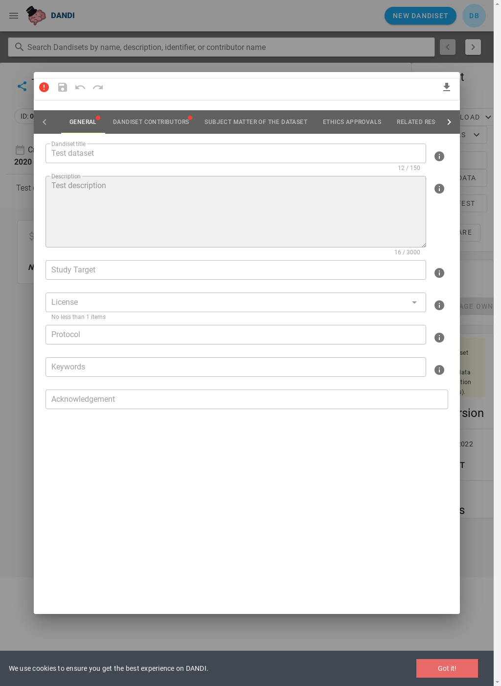 | 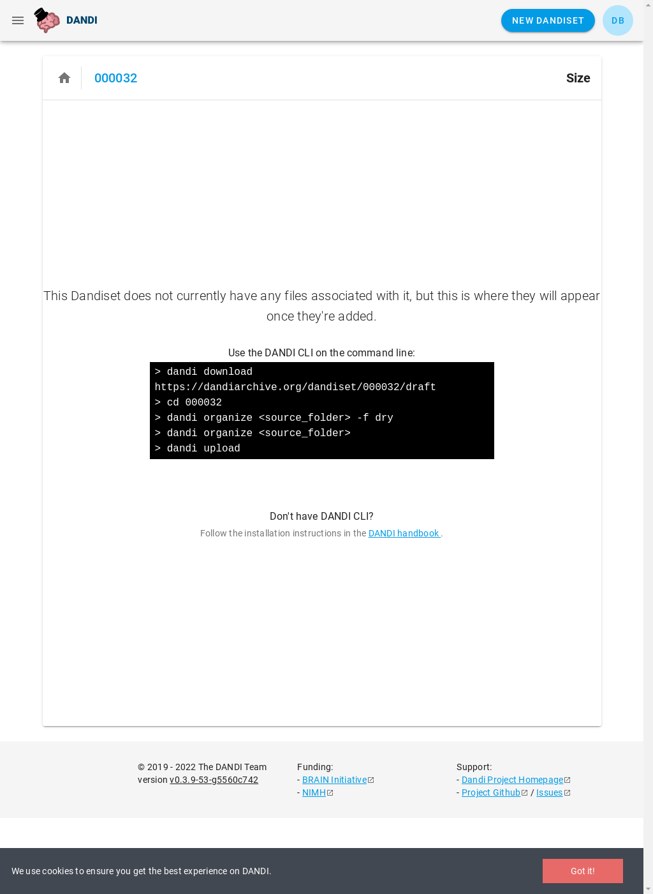 |

### 000033

| t=1.16 [Go to page](https://gui.dandiarchive.org/#/dandiset/000033) | t=0.53 Edit Metadata | t=0.61 [Go to page](https://gui.dandiarchive.org/#/dandiset/000033/draft/files) |
| --- | --- | --- |
|  | 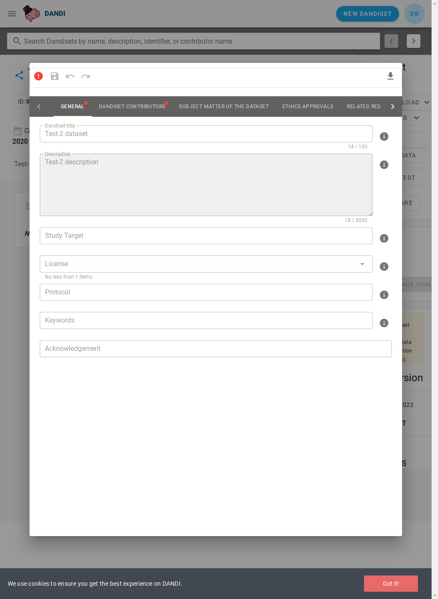 |  |

### 000034

| t=1.14 [Go to page](https://gui.dandiarchive.org/#/dandiset/000034) | t=2.72 Edit Metadata | t=0.67 [Go to page](https://gui.dandiarchive.org/#/dandiset/000034/draft/files) |
| --- | --- | --- |
| 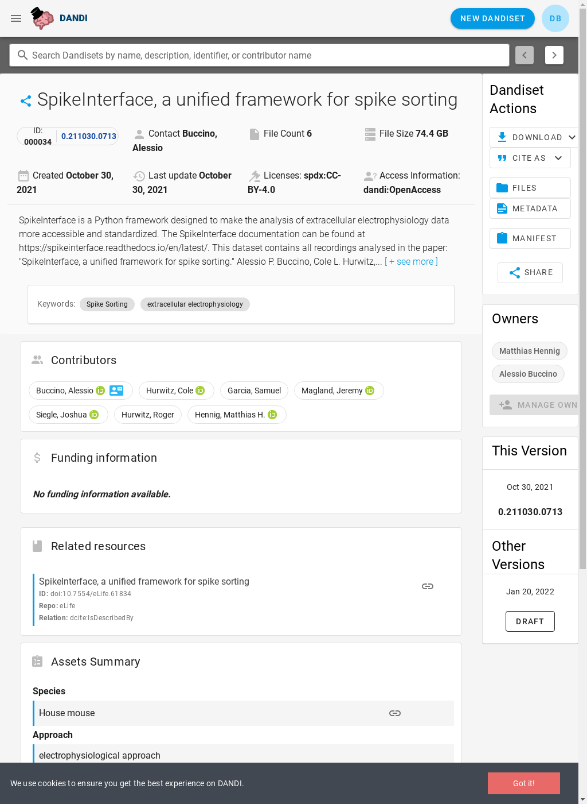 |  |  |

### 000035

| t=2.14 [Go to page](https://gui.dandiarchive.org/#/dandiset/000035) | t=6.59 Edit Metadata | t=0.78 [Go to page](https://gui.dandiarchive.org/#/dandiset/000035/draft/files) |
| --- | --- | --- |
|  |  |  |

### 000036

| t=1.62 [Go to page](https://gui.dandiarchive.org/#/dandiset/000036) | t=0.89 Edit Metadata | t=0.61 [Go to page](https://gui.dandiarchive.org/#/dandiset/000036/draft/files) |
| --- | --- | --- |
|  |  |  |

### 000037

| t=1.66 [Go to page](https://gui.dandiarchive.org/#/dandiset/000037) | t=3.06 Edit Metadata | t=0.69 [Go to page](https://gui.dandiarchive.org/#/dandiset/000037/draft/files) |
| --- | --- | --- |
|  |  |  |

### 000038

| t=1.11 [Go to page](https://gui.dandiarchive.org/#/dandiset/000038) | t=0.61 Edit Metadata | t=0.60 [Go to page](https://gui.dandiarchive.org/#/dandiset/000038/draft/files) |
| --- | --- | --- |
| 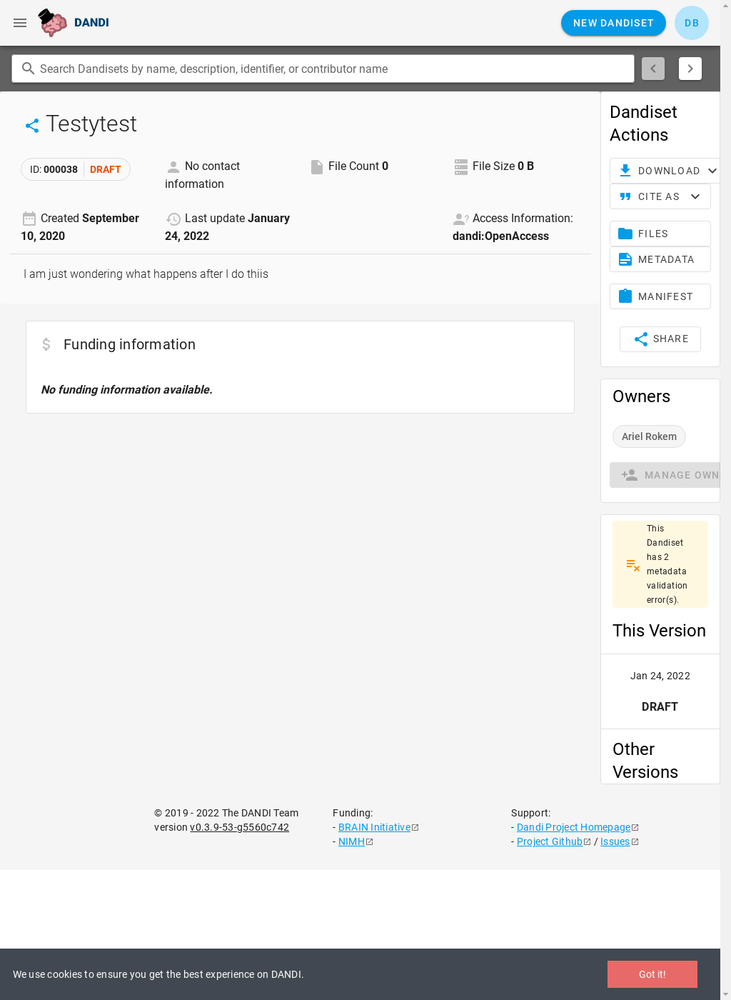 |  |  |

### 000039

| t=1.20 [Go to page](https://gui.dandiarchive.org/#/dandiset/000039) | t=1.20 Edit Metadata | t=0.62 [Go to page](https://gui.dandiarchive.org/#/dandiset/000039/draft/files) |
| --- | --- | --- |
| 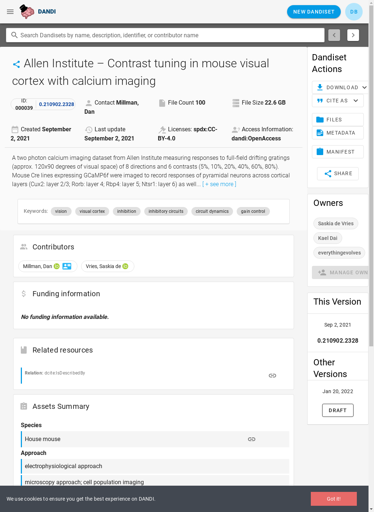 | 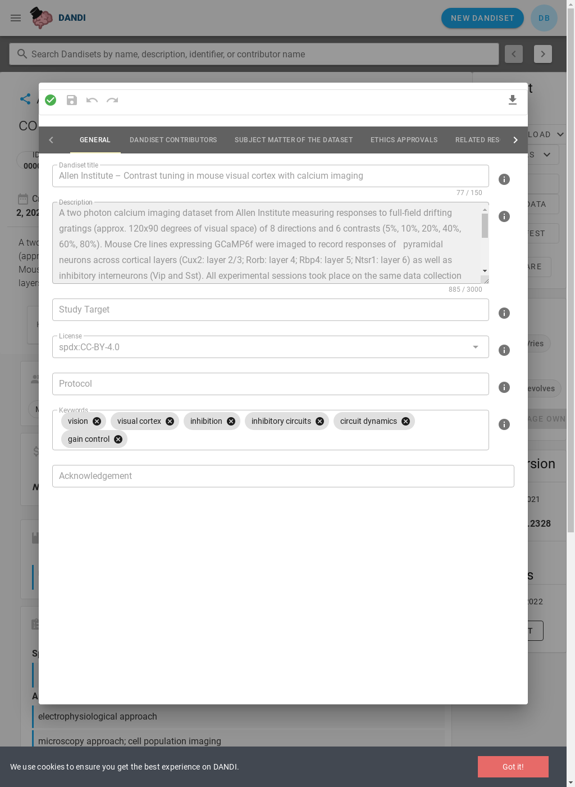 |  |

### 000040

| t=1.10 [Go to page](https://gui.dandiarchive.org/#/dandiset/000040) | t=Message: unknown error: session deleted because of page crash
from unknown error: cannot determine loading status
from tab crashed
  (Session info: headless chrome=73.0.3683.75)
  (Driver info: chromedriver=73.0.3683.75,platform=Linux 4.19.0-0.bpo.9-amd64 x86_64) Edit Metadata | t=Message: invalid session id
  (Driver info: chromedriver=73.0.3683.75,platform=Linux 4.19.0-0.bpo.9-amd64 x86_64) [Go to page](https://gui.dandiarchive.org/#/dandiset/000040/draft/files) |
| --- | --- | --- |
|  |  |  |

### 000041

| t=Message: invalid session id
  (Driver info: chromedriver=73.0.3683.75,platform=Linux 4.19.0-0.bpo.9-amd64 x86_64) [Go to page](https://gui.dandiarchive.org/#/dandiset/000041) | t=Message: invalid session id
  (Driver info: chromedriver=73.0.3683.75,platform=Linux 4.19.0-0.bpo.9-amd64 x86_64) Edit Metadata | t=Message: invalid session id
  (Driver info: chromedriver=73.0.3683.75,platform=Linux 4.19.0-0.bpo.9-amd64 x86_64) [Go to page](https://gui.dandiarchive.org/#/dandiset/000041/draft/files) |
| --- | --- | --- |
|  |  |  |

### 000042

| t=Message: invalid session id
  (Driver info: chromedriver=73.0.3683.75,platform=Linux 4.19.0-0.bpo.9-amd64 x86_64) [Go to page](https://gui.dandiarchive.org/#/dandiset/000042) | t=Message: invalid session id
  (Driver info: chromedriver=73.0.3683.75,platform=Linux 4.19.0-0.bpo.9-amd64 x86_64) Edit Metadata | t=Message: invalid session id
  (Driver info: chromedriver=73.0.3683.75,platform=Linux 4.19.0-0.bpo.9-amd64 x86_64) [Go to page](https://gui.dandiarchive.org/#/dandiset/000042/draft/files) |
| --- | --- | --- |
|  | 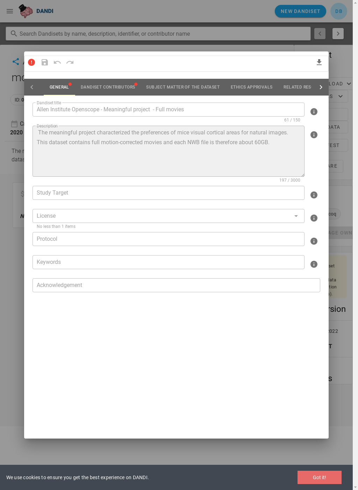 |  |

### 000043

| t=Message: invalid session id
  (Driver info: chromedriver=73.0.3683.75,platform=Linux 4.19.0-0.bpo.9-amd64 x86_64) [Go to page](https://gui.dandiarchive.org/#/dandiset/000043) | t=Message: invalid session id
  (Driver info: chromedriver=73.0.3683.75,platform=Linux 4.19.0-0.bpo.9-amd64 x86_64) Edit Metadata | t=Message: invalid session id
  (Driver info: chromedriver=73.0.3683.75,platform=Linux 4.19.0-0.bpo.9-amd64 x86_64) [Go to page](https://gui.dandiarchive.org/#/dandiset/000043/draft/files) |
| --- | --- | --- |
|  |  | 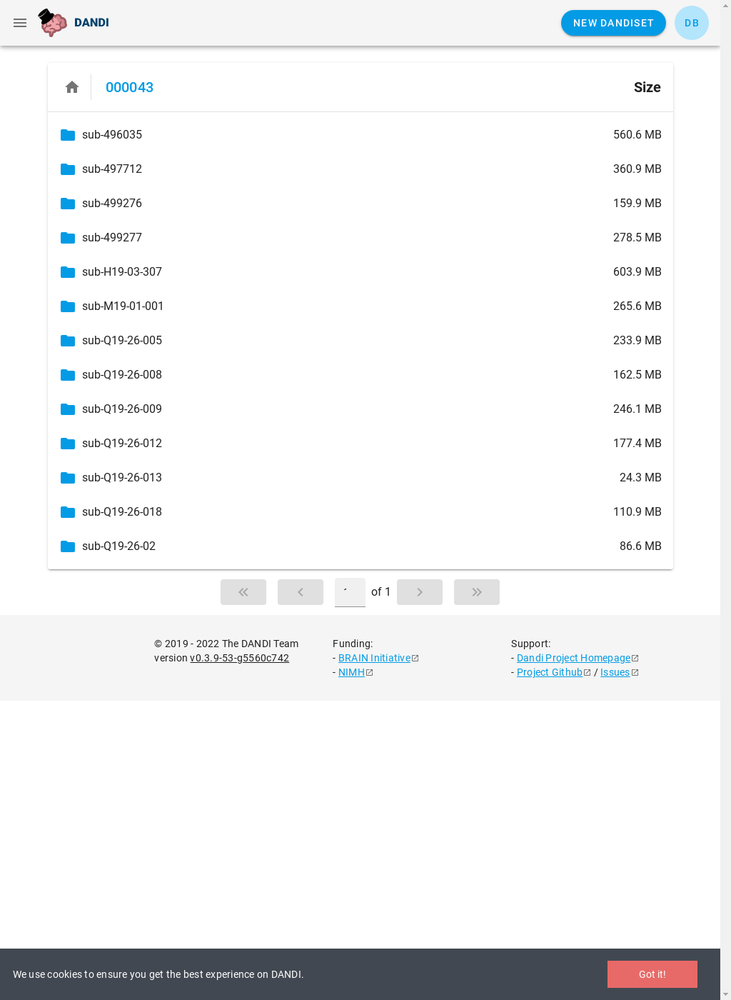 |

### 000044

| t=Message: invalid session id
  (Driver info: chromedriver=73.0.3683.75,platform=Linux 4.19.0-0.bpo.9-amd64 x86_64) [Go to page](https://gui.dandiarchive.org/#/dandiset/000044) | t=Message: invalid session id
  (Driver info: chromedriver=73.0.3683.75,platform=Linux 4.19.0-0.bpo.9-amd64 x86_64) Edit Metadata | t=Message: invalid session id
  (Driver info: chromedriver=73.0.3683.75,platform=Linux 4.19.0-0.bpo.9-amd64 x86_64) [Go to page](https://gui.dandiarchive.org/#/dandiset/000044/draft/files) |
| --- | --- | --- |
|  |  | 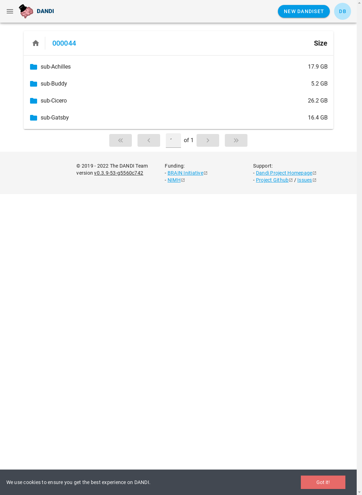 |

### 000045

| t=Message: invalid session id
  (Driver info: chromedriver=73.0.3683.75,platform=Linux 4.19.0-0.bpo.9-amd64 x86_64) [Go to page](https://gui.dandiarchive.org/#/dandiset/000045) | t=Message: invalid session id
  (Driver info: chromedriver=73.0.3683.75,platform=Linux 4.19.0-0.bpo.9-amd64 x86_64) Edit Metadata | t=Message: invalid session id
  (Driver info: chromedriver=73.0.3683.75,platform=Linux 4.19.0-0.bpo.9-amd64 x86_64) [Go to page](https://gui.dandiarchive.org/#/dandiset/000045/draft/files) |
| --- | --- | --- |
|  | 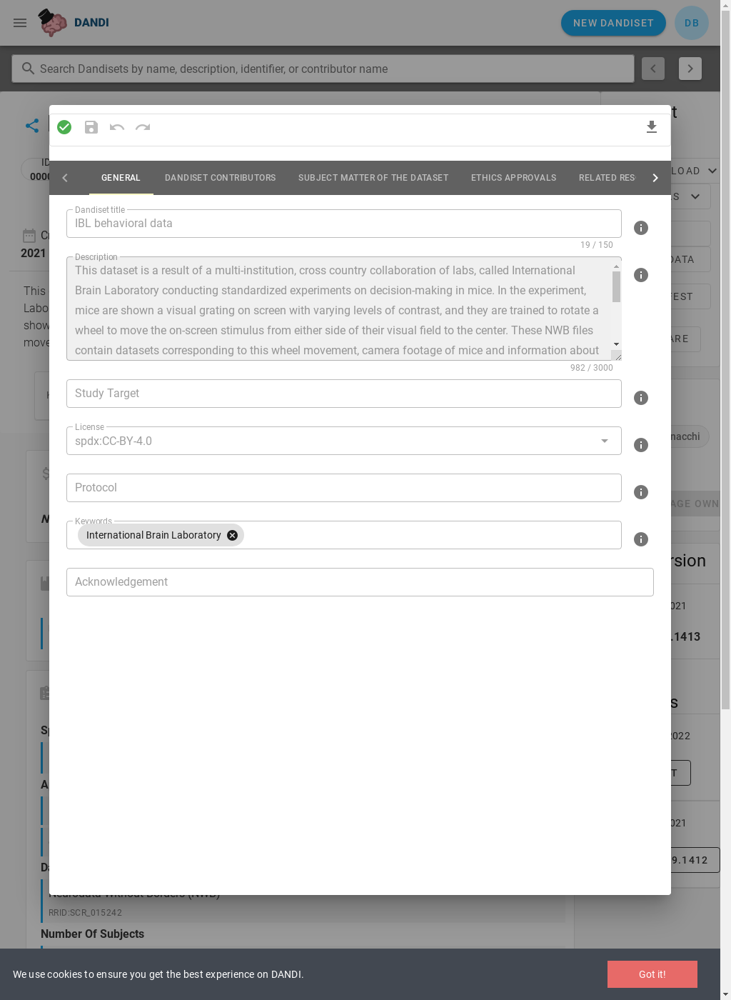 |  |

### 000046

| t=Message: invalid session id
  (Driver info: chromedriver=73.0.3683.75,platform=Linux 4.19.0-0.bpo.9-amd64 x86_64) [Go to page](https://gui.dandiarchive.org/#/dandiset/000046) | t=Message: invalid session id
  (Driver info: chromedriver=73.0.3683.75,platform=Linux 4.19.0-0.bpo.9-amd64 x86_64) Edit Metadata | t=Message: invalid session id
  (Driver info: chromedriver=73.0.3683.75,platform=Linux 4.19.0-0.bpo.9-amd64 x86_64) [Go to page](https://gui.dandiarchive.org/#/dandiset/000046/draft/files) |
| --- | --- | --- |
|  |  |  |

### 000047

| t=Message: invalid session id
  (Driver info: chromedriver=73.0.3683.75,platform=Linux 4.19.0-0.bpo.9-amd64 x86_64) [Go to page](https://gui.dandiarchive.org/#/dandiset/000047) | t=Message: invalid session id
  (Driver info: chromedriver=73.0.3683.75,platform=Linux 4.19.0-0.bpo.9-amd64 x86_64) Edit Metadata | t=Message: invalid session id
  (Driver info: chromedriver=73.0.3683.75,platform=Linux 4.19.0-0.bpo.9-amd64 x86_64) [Go to page](https://gui.dandiarchive.org/#/dandiset/000047/draft/files) |
| --- | --- | --- |
|  |  |  |

### 000048

| t=Message: invalid session id
  (Driver info: chromedriver=73.0.3683.75,platform=Linux 4.19.0-0.bpo.9-amd64 x86_64) [Go to page](https://gui.dandiarchive.org/#/dandiset/000048) | t=Message: invalid session id
  (Driver info: chromedriver=73.0.3683.75,platform=Linux 4.19.0-0.bpo.9-amd64 x86_64) Edit Metadata | t=Message: invalid session id
  (Driver info: chromedriver=73.0.3683.75,platform=Linux 4.19.0-0.bpo.9-amd64 x86_64) [Go to page](https://gui.dandiarchive.org/#/dandiset/000048/draft/files) |
| --- | --- | --- |
|  |  | 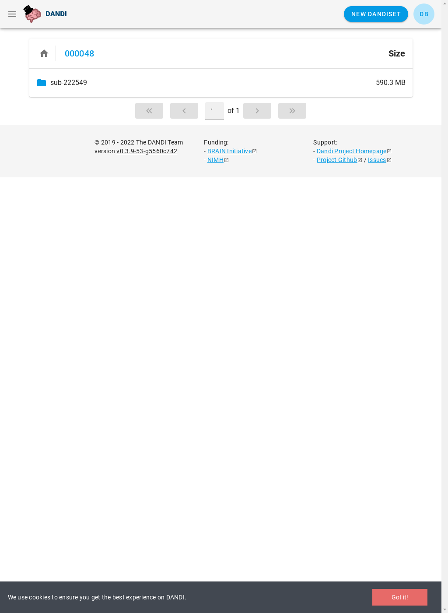 |

### 000049

| t=Message: invalid session id
  (Driver info: chromedriver=73.0.3683.75,platform=Linux 4.19.0-0.bpo.9-amd64 x86_64) [Go to page](https://gui.dandiarchive.org/#/dandiset/000049) | t=Message: invalid session id
  (Driver info: chromedriver=73.0.3683.75,platform=Linux 4.19.0-0.bpo.9-amd64 x86_64) Edit Metadata | t=Message: invalid session id
  (Driver info: chromedriver=73.0.3683.75,platform=Linux 4.19.0-0.bpo.9-amd64 x86_64) [Go to page](https://gui.dandiarchive.org/#/dandiset/000049/draft/files) |
| --- | --- | --- |
|  |  |  |

### 000050

| t=Message: invalid session id
  (Driver info: chromedriver=73.0.3683.75,platform=Linux 4.19.0-0.bpo.9-amd64 x86_64) [Go to page](https://gui.dandiarchive.org/#/dandiset/000050) | t=Message: invalid session id
  (Driver info: chromedriver=73.0.3683.75,platform=Linux 4.19.0-0.bpo.9-amd64 x86_64) Edit Metadata | t=Message: invalid session id
  (Driver info: chromedriver=73.0.3683.75,platform=Linux 4.19.0-0.bpo.9-amd64 x86_64) [Go to page](https://gui.dandiarchive.org/#/dandiset/000050/draft/files) |
| --- | --- | --- |
|  |  |  |

### 000051

| t=Message: invalid session id
  (Driver info: chromedriver=73.0.3683.75,platform=Linux 4.19.0-0.bpo.9-amd64 x86_64) [Go to page](https://gui.dandiarchive.org/#/dandiset/000051) | t=Message: invalid session id
  (Driver info: chromedriver=73.0.3683.75,platform=Linux 4.19.0-0.bpo.9-amd64 x86_64) Edit Metadata | t=Message: invalid session id
  (Driver info: chromedriver=73.0.3683.75,platform=Linux 4.19.0-0.bpo.9-amd64 x86_64) [Go to page](https://gui.dandiarchive.org/#/dandiset/000051/draft/files) |
| --- | --- | --- |
|  | 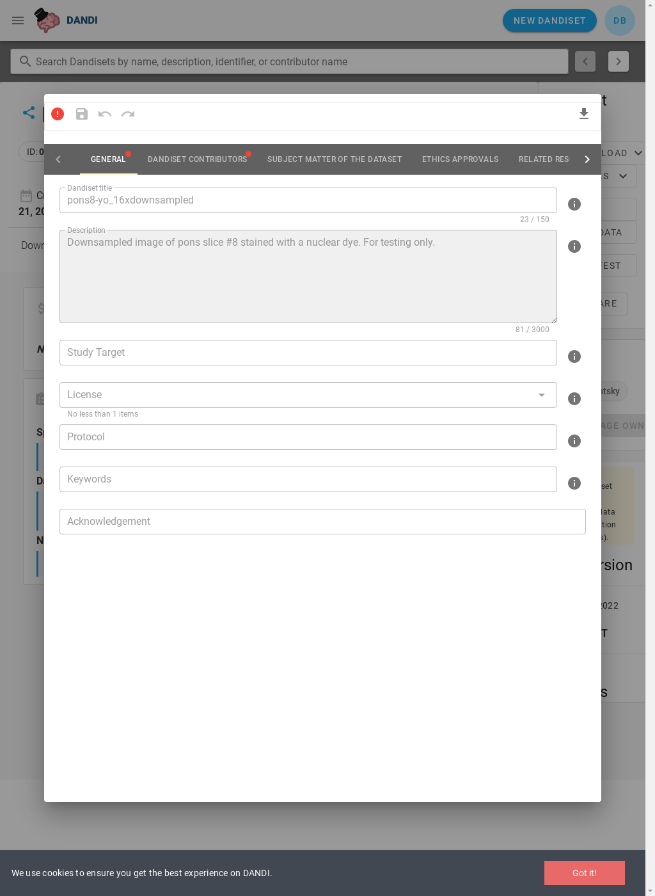 |  |

### 000052

| t=Message: invalid session id
  (Driver info: chromedriver=73.0.3683.75,platform=Linux 4.19.0-0.bpo.9-amd64 x86_64) [Go to page](https://gui.dandiarchive.org/#/dandiset/000052) | t=Message: invalid session id
  (Driver info: chromedriver=73.0.3683.75,platform=Linux 4.19.0-0.bpo.9-amd64 x86_64) Edit Metadata | t=Message: invalid session id
  (Driver info: chromedriver=73.0.3683.75,platform=Linux 4.19.0-0.bpo.9-amd64 x86_64) [Go to page](https://gui.dandiarchive.org/#/dandiset/000052/draft/files) |
| --- | --- | --- |
|  |  |  |

### 000053

| t=Message: invalid session id
  (Driver info: chromedriver=73.0.3683.75,platform=Linux 4.19.0-0.bpo.9-amd64 x86_64) [Go to page](https://gui.dandiarchive.org/#/dandiset/000053) | t=Message: invalid session id
  (Driver info: chromedriver=73.0.3683.75,platform=Linux 4.19.0-0.bpo.9-amd64 x86_64) Edit Metadata | t=Message: invalid session id
  (Driver info: chromedriver=73.0.3683.75,platform=Linux 4.19.0-0.bpo.9-amd64 x86_64) [Go to page](https://gui.dandiarchive.org/#/dandiset/000053/draft/files) |
| --- | --- | --- |
|  |  |  |

### 000054

| t=Message: invalid session id
  (Driver info: chromedriver=73.0.3683.75,platform=Linux 4.19.0-0.bpo.9-amd64 x86_64) [Go to page](https://gui.dandiarchive.org/#/dandiset/000054) | t=Message: invalid session id
  (Driver info: chromedriver=73.0.3683.75,platform=Linux 4.19.0-0.bpo.9-amd64 x86_64) Edit Metadata | t=Message: invalid session id
  (Driver info: chromedriver=73.0.3683.75,platform=Linux 4.19.0-0.bpo.9-amd64 x86_64) [Go to page](https://gui.dandiarchive.org/#/dandiset/000054/draft/files) |
| --- | --- | --- |
| 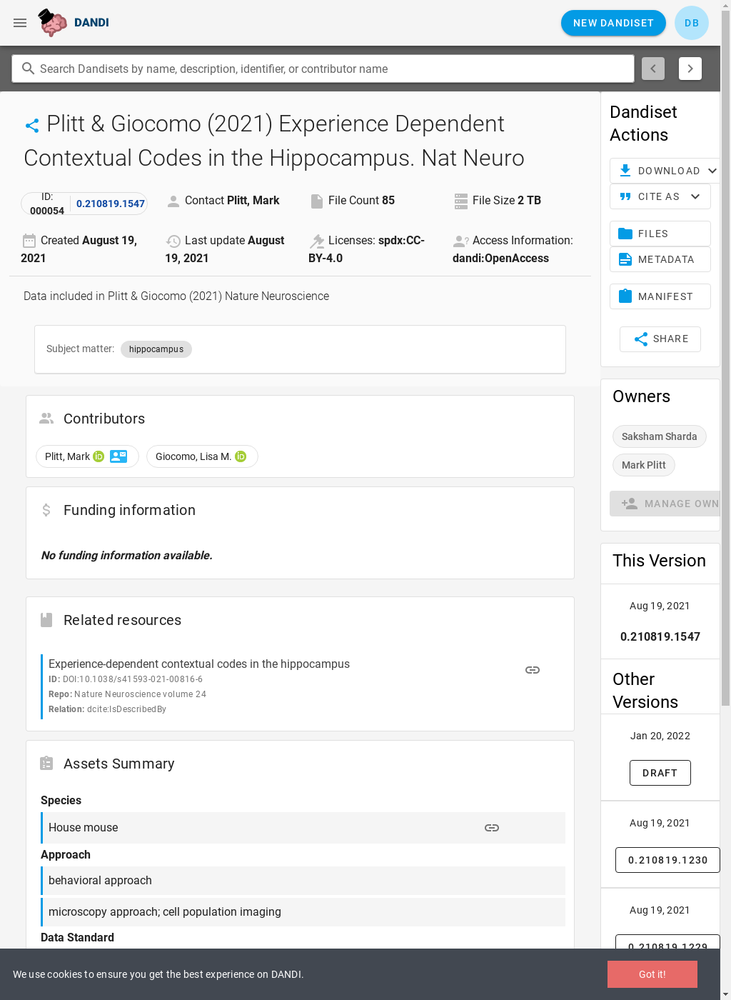 | 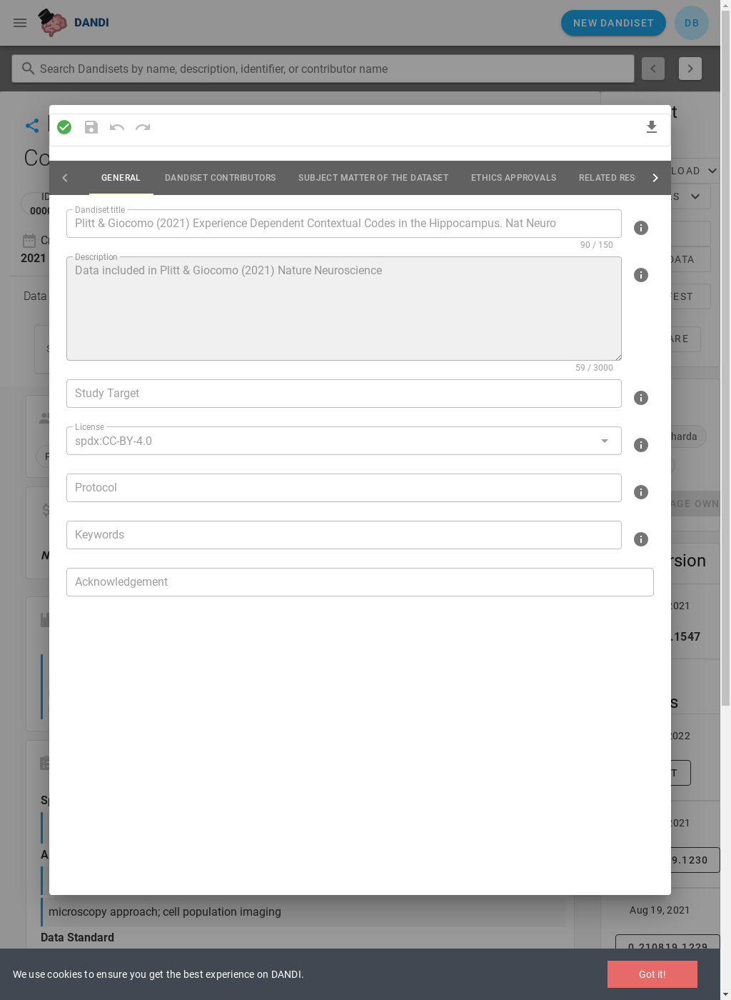 |  |

### 000055

| t=Message: invalid session id
  (Driver info: chromedriver=73.0.3683.75,platform=Linux 4.19.0-0.bpo.9-amd64 x86_64) [Go to page](https://gui.dandiarchive.org/#/dandiset/000055) | t=Message: invalid session id
  (Driver info: chromedriver=73.0.3683.75,platform=Linux 4.19.0-0.bpo.9-amd64 x86_64) Edit Metadata | t=Message: invalid session id
  (Driver info: chromedriver=73.0.3683.75,platform=Linux 4.19.0-0.bpo.9-amd64 x86_64) [Go to page](https://gui.dandiarchive.org/#/dandiset/000055/draft/files) |
| --- | --- | --- |
|  | 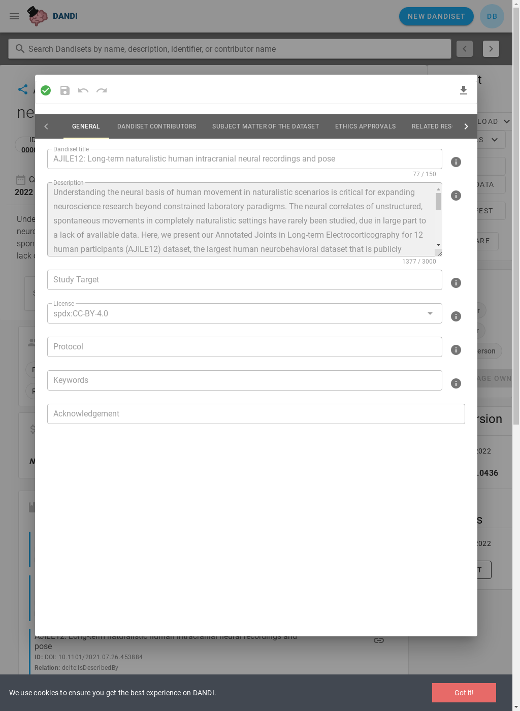 |  |

### 000056

| t=Message: invalid session id
  (Driver info: chromedriver=73.0.3683.75,platform=Linux 4.19.0-0.bpo.9-amd64 x86_64) [Go to page](https://gui.dandiarchive.org/#/dandiset/000056) | t=Message: invalid session id
  (Driver info: chromedriver=73.0.3683.75,platform=Linux 4.19.0-0.bpo.9-amd64 x86_64) Edit Metadata | t=Message: invalid session id
  (Driver info: chromedriver=73.0.3683.75,platform=Linux 4.19.0-0.bpo.9-amd64 x86_64) [Go to page](https://gui.dandiarchive.org/#/dandiset/000056/draft/files) |
| --- | --- | --- |
|  |  |  |

### 000057

| t=Message: invalid session id
  (Driver info: chromedriver=73.0.3683.75,platform=Linux 4.19.0-0.bpo.9-amd64 x86_64) [Go to page](https://gui.dandiarchive.org/#/dandiset/000057) | t=Message: invalid session id
  (Driver info: chromedriver=73.0.3683.75,platform=Linux 4.19.0-0.bpo.9-amd64 x86_64) Edit Metadata | t=Message: invalid session id
  (Driver info: chromedriver=73.0.3683.75,platform=Linux 4.19.0-0.bpo.9-amd64 x86_64) [Go to page](https://gui.dandiarchive.org/#/dandiset/000057/draft/files) |
| --- | --- | --- |
|  |  | 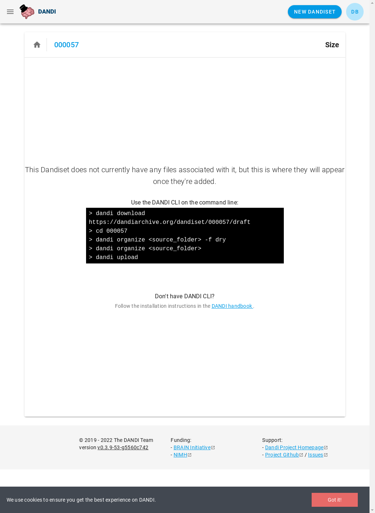 |

### 000058

| t=Message: invalid session id
  (Driver info: chromedriver=73.0.3683.75,platform=Linux 4.19.0-0.bpo.9-amd64 x86_64) [Go to page](https://gui.dandiarchive.org/#/dandiset/000058) | t=Message: invalid session id
  (Driver info: chromedriver=73.0.3683.75,platform=Linux 4.19.0-0.bpo.9-amd64 x86_64) Edit Metadata | t=Message: invalid session id
  (Driver info: chromedriver=73.0.3683.75,platform=Linux 4.19.0-0.bpo.9-amd64 x86_64) [Go to page](https://gui.dandiarchive.org/#/dandiset/000058/draft/files) |
| --- | --- | --- |
|  |  |  |

### 000059

| t=Message: invalid session id
  (Driver info: chromedriver=73.0.3683.75,platform=Linux 4.19.0-0.bpo.9-amd64 x86_64) [Go to page](https://gui.dandiarchive.org/#/dandiset/000059) | t=Message: invalid session id
  (Driver info: chromedriver=73.0.3683.75,platform=Linux 4.19.0-0.bpo.9-amd64 x86_64) Edit Metadata | t=Message: invalid session id
  (Driver info: chromedriver=73.0.3683.75,platform=Linux 4.19.0-0.bpo.9-amd64 x86_64) [Go to page](https://gui.dandiarchive.org/#/dandiset/000059/draft/files) |
| --- | --- | --- |
|  |  |  |

### 000060

| t=Message: invalid session id
  (Driver info: chromedriver=73.0.3683.75,platform=Linux 4.19.0-0.bpo.9-amd64 x86_64) [Go to page](https://gui.dandiarchive.org/#/dandiset/000060) | t=Message: invalid session id
  (Driver info: chromedriver=73.0.3683.75,platform=Linux 4.19.0-0.bpo.9-amd64 x86_64) Edit Metadata | t=Message: invalid session id
  (Driver info: chromedriver=73.0.3683.75,platform=Linux 4.19.0-0.bpo.9-amd64 x86_64) [Go to page](https://gui.dandiarchive.org/#/dandiset/000060/draft/files) |
| --- | --- | --- |
|  | 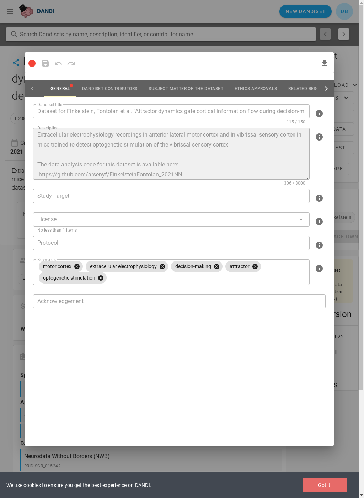 |  |

### 000061

| t=Message: invalid session id
  (Driver info: chromedriver=73.0.3683.75,platform=Linux 4.19.0-0.bpo.9-amd64 x86_64) [Go to page](https://gui.dandiarchive.org/#/dandiset/000061) | t=Message: invalid session id
  (Driver info: chromedriver=73.0.3683.75,platform=Linux 4.19.0-0.bpo.9-amd64 x86_64) Edit Metadata | t=Message: invalid session id
  (Driver info: chromedriver=73.0.3683.75,platform=Linux 4.19.0-0.bpo.9-amd64 x86_64) [Go to page](https://gui.dandiarchive.org/#/dandiset/000061/draft/files) |
| --- | --- | --- |
|  | 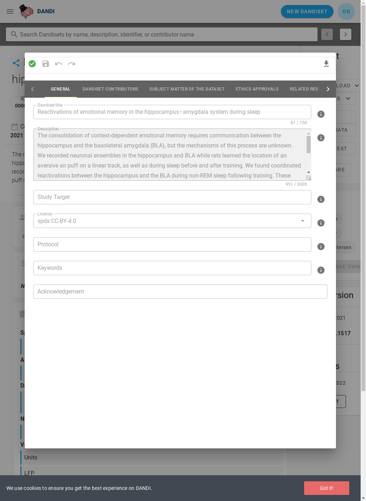 |  |

### 000063

| t=Message: invalid session id
  (Driver info: chromedriver=73.0.3683.75,platform=Linux 4.19.0-0.bpo.9-amd64 x86_64) [Go to page](https://gui.dandiarchive.org/#/dandiset/000063) | t=Message: invalid session id
  (Driver info: chromedriver=73.0.3683.75,platform=Linux 4.19.0-0.bpo.9-amd64 x86_64) Edit Metadata | t=Message: invalid session id
  (Driver info: chromedriver=73.0.3683.75,platform=Linux 4.19.0-0.bpo.9-amd64 x86_64) [Go to page](https://gui.dandiarchive.org/#/dandiset/000063/draft/files) |
| --- | --- | --- |
|  | 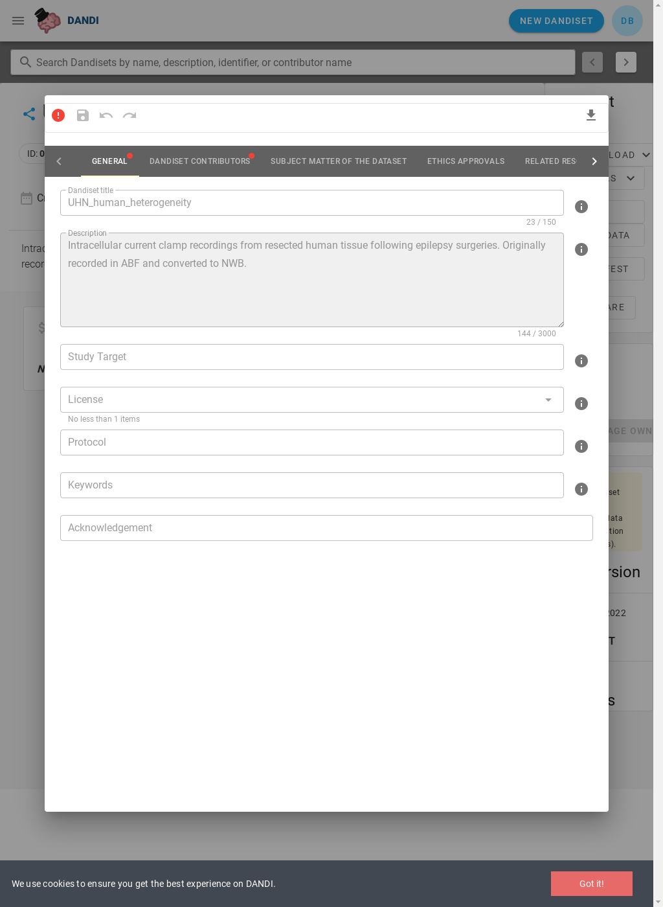 |  |

### 000064

| t=Message: invalid session id
  (Driver info: chromedriver=73.0.3683.75,platform=Linux 4.19.0-0.bpo.9-amd64 x86_64) [Go to page](https://gui.dandiarchive.org/#/dandiset/000064) | t=Message: invalid session id
  (Driver info: chromedriver=73.0.3683.75,platform=Linux 4.19.0-0.bpo.9-amd64 x86_64) Edit Metadata | t=Message: invalid session id
  (Driver info: chromedriver=73.0.3683.75,platform=Linux 4.19.0-0.bpo.9-amd64 x86_64) [Go to page](https://gui.dandiarchive.org/#/dandiset/000064/draft/files) |
| --- | --- | --- |
|  |  |  |

### 000065

| t=Message: invalid session id
  (Driver info: chromedriver=73.0.3683.75,platform=Linux 4.19.0-0.bpo.9-amd64 x86_64) [Go to page](https://gui.dandiarchive.org/#/dandiset/000065) | t=Message: invalid session id
  (Driver info: chromedriver=73.0.3683.75,platform=Linux 4.19.0-0.bpo.9-amd64 x86_64) Edit Metadata | t=Message: invalid session id
  (Driver info: chromedriver=73.0.3683.75,platform=Linux 4.19.0-0.bpo.9-amd64 x86_64) [Go to page](https://gui.dandiarchive.org/#/dandiset/000065/draft/files) |
| --- | --- | --- |
|  |  |  |

### 000066

| t=Message: invalid session id
  (Driver info: chromedriver=73.0.3683.75,platform=Linux 4.19.0-0.bpo.9-amd64 x86_64) [Go to page](https://gui.dandiarchive.org/#/dandiset/000066) | t=Message: invalid session id
  (Driver info: chromedriver=73.0.3683.75,platform=Linux 4.19.0-0.bpo.9-amd64 x86_64) Edit Metadata | t=Message: invalid session id
  (Driver info: chromedriver=73.0.3683.75,platform=Linux 4.19.0-0.bpo.9-amd64 x86_64) [Go to page](https://gui.dandiarchive.org/#/dandiset/000066/draft/files) |
| --- | --- | --- |
|  |  | 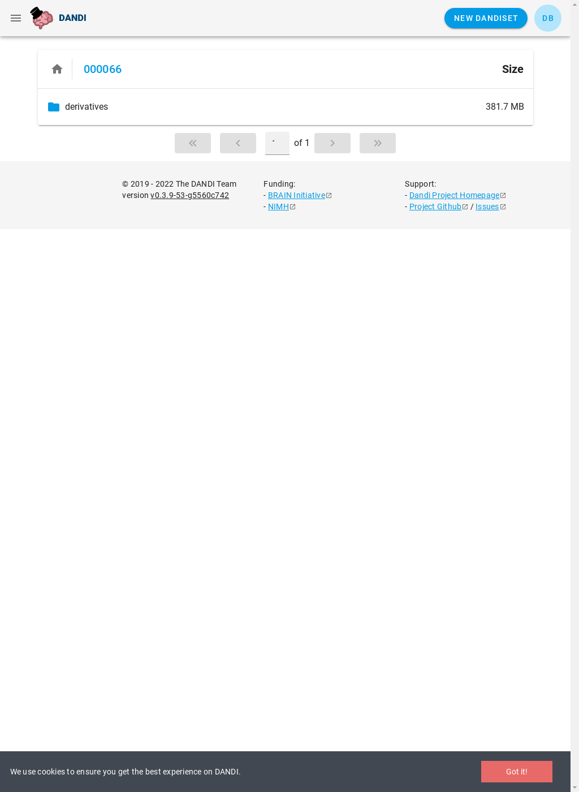 |

### 000067

| t=Message: invalid session id
  (Driver info: chromedriver=73.0.3683.75,platform=Linux 4.19.0-0.bpo.9-amd64 x86_64) [Go to page](https://gui.dandiarchive.org/#/dandiset/000067) | t=Message: invalid session id
  (Driver info: chromedriver=73.0.3683.75,platform=Linux 4.19.0-0.bpo.9-amd64 x86_64) Edit Metadata | t=Message: invalid session id
  (Driver info: chromedriver=73.0.3683.75,platform=Linux 4.19.0-0.bpo.9-amd64 x86_64) [Go to page](https://gui.dandiarchive.org/#/dandiset/000067/draft/files) |
| --- | --- | --- |
|  |  |  |

### 000068

| t=Message: invalid session id
  (Driver info: chromedriver=73.0.3683.75,platform=Linux 4.19.0-0.bpo.9-amd64 x86_64) [Go to page](https://gui.dandiarchive.org/#/dandiset/000068) | t=Message: invalid session id
  (Driver info: chromedriver=73.0.3683.75,platform=Linux 4.19.0-0.bpo.9-amd64 x86_64) Edit Metadata | t=Message: invalid session id
  (Driver info: chromedriver=73.0.3683.75,platform=Linux 4.19.0-0.bpo.9-amd64 x86_64) [Go to page](https://gui.dandiarchive.org/#/dandiset/000068/draft/files) |
| --- | --- | --- |
|  | 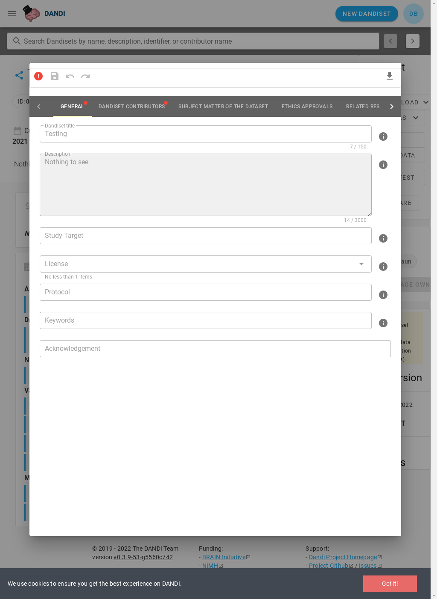 | 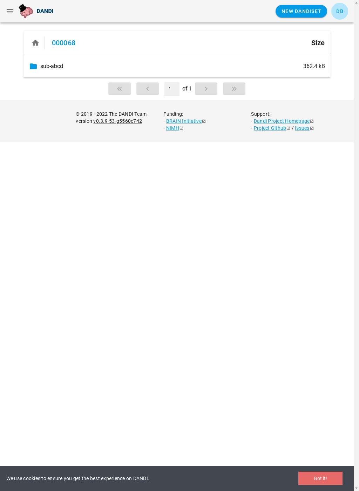 |

### 000069

| t=Message: invalid session id
  (Driver info: chromedriver=73.0.3683.75,platform=Linux 4.19.0-0.bpo.9-amd64 x86_64) [Go to page](https://gui.dandiarchive.org/#/dandiset/000069) | t=Message: invalid session id
  (Driver info: chromedriver=73.0.3683.75,platform=Linux 4.19.0-0.bpo.9-amd64 x86_64) Edit Metadata | t=Message: invalid session id
  (Driver info: chromedriver=73.0.3683.75,platform=Linux 4.19.0-0.bpo.9-amd64 x86_64) [Go to page](https://gui.dandiarchive.org/#/dandiset/000069/draft/files) |
| --- | --- | --- |
| 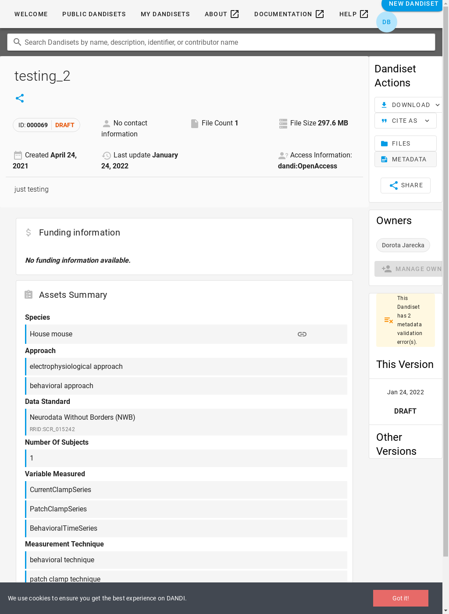 |  |  |

### 000070

| t=Message: invalid session id
  (Driver info: chromedriver=73.0.3683.75,platform=Linux 4.19.0-0.bpo.9-amd64 x86_64) [Go to page](https://gui.dandiarchive.org/#/dandiset/000070) | t=Message: invalid session id
  (Driver info: chromedriver=73.0.3683.75,platform=Linux 4.19.0-0.bpo.9-amd64 x86_64) Edit Metadata | t=Message: invalid session id
  (Driver info: chromedriver=73.0.3683.75,platform=Linux 4.19.0-0.bpo.9-amd64 x86_64) [Go to page](https://gui.dandiarchive.org/#/dandiset/000070/draft/files) |
| --- | --- | --- |
|  |  |  |

### 000071

| t=Message: invalid session id
  (Driver info: chromedriver=73.0.3683.75,platform=Linux 4.19.0-0.bpo.9-amd64 x86_64) [Go to page](https://gui.dandiarchive.org/#/dandiset/000071) | t=Message: invalid session id
  (Driver info: chromedriver=73.0.3683.75,platform=Linux 4.19.0-0.bpo.9-amd64 x86_64) Edit Metadata | t=Message: invalid session id
  (Driver info: chromedriver=73.0.3683.75,platform=Linux 4.19.0-0.bpo.9-amd64 x86_64) [Go to page](https://gui.dandiarchive.org/#/dandiset/000071/draft/files) |
| --- | --- | --- |
|  |  | 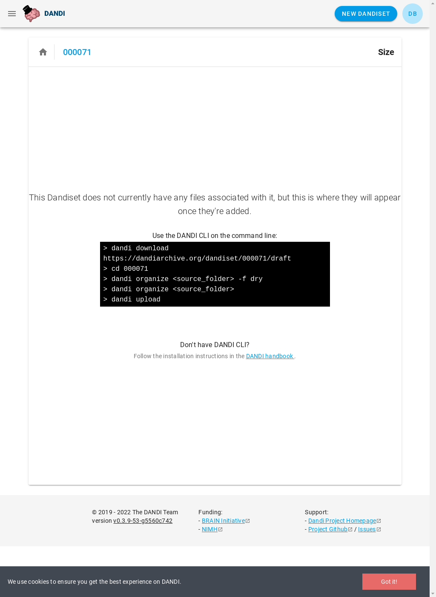 |

